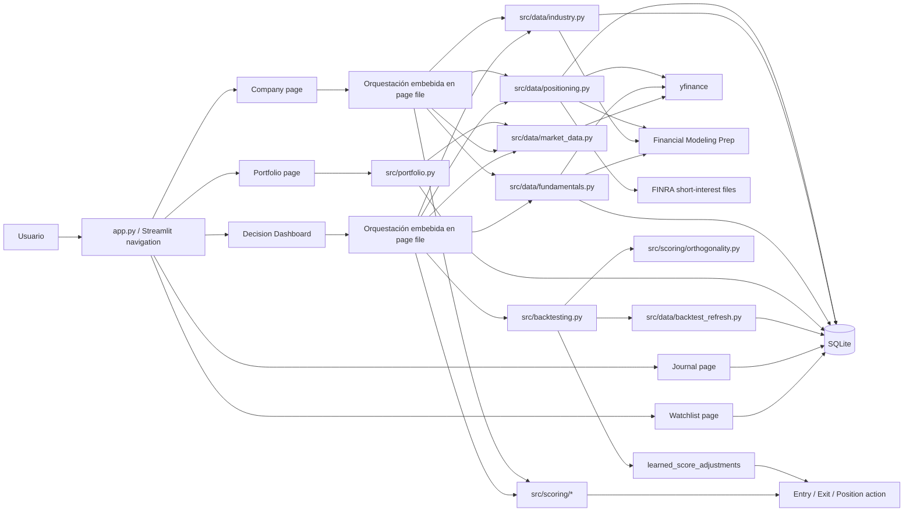
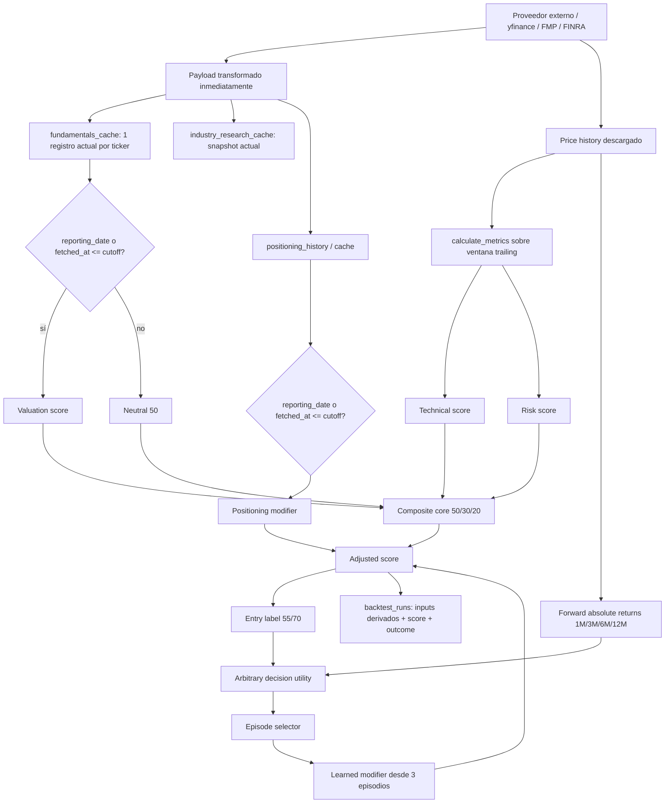
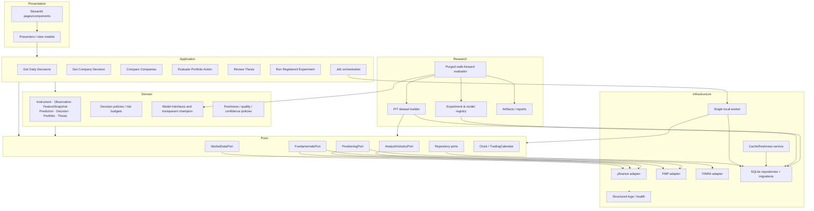
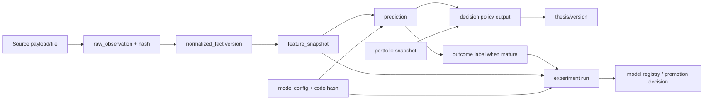

# PersonalEquityRadar — revisión forense de inversión, producto y arquitectura

**Fecha de revisión:** 13 de julio de 2026  
**Objeto:** `PersonalEquityRadar_AuditBundle.zip`  
**Alcance:** código, tests, documentación, base SQLite sanitizada, ejecución local controlada y benchmark selectivo de producto.  
**Objetivo normativo:** maximizar la capitalización esperada a largo plazo, neta de costes y ajustada por riesgo, preservando capital, limitando drawdowns evitables, controlando concentración y model risk, y manteniendo explicabilidad suficiente para que el inversor pueda impugnar cada recomendación.

**Convención de evidencia**

- **Verified:** demostrado por código, tests, datos almacenados o ejecución observada.
- **Inferred:** consecuencia fuerte de evidencia directa, pero no ejecutada en todas las condiciones.
- **Hypothesis:** propuesta plausible que necesita experimento.
- **Blocked:** no se pudo validar; se indica el motivo exacto.

No se reproducen secretos, claves, texto privado del Journal, cantidades, costes de adquisición ni otros datos financieros personales. Las tablas personales del bundle sanitizado estaban vacías; el análisis empírico usa exclusivamente registros de investigación/backtest agregados.

---

## 1. Executive verdict

### Qué es hoy

PersonalEquityRadar es un **cockpit local de research personal** construido con Python, Streamlit y SQLite. Integra watchlist, análisis de compañía, un dashboard de decisiones, portfolio, Journal, una reconstrucción histórica denominada Time Machine y módulos explícitos de scoring, positioning, aprendizaje y orthogonality. El sistema produce una puntuación de entrada basada, en su ruta principal, en Technical, Valuation y Risk; en determinados estados sustituye esa puntuación por un composite de Industry; añade modificadores pequeños de positioning y de “backtested learning”; y transforma el resultado en etiquetas `Buy candidate`, `Watch` o `Wait`. Para posiciones existentes aplica después reglas de `Add`, `Hold`, `Monitor`, `Trim` o `Exit review`.

La aplicación **arranca, navega y tiene una base de ingeniería funcional**. En un entorno virtual limpio se instalaron las dependencias declaradas; `python -m pytest -q` terminó con **94/94 tests superados**; la compilación e importación de 31 módulos no produjo fallos; el servidor Streamlit respondió correctamente; y los cinco flujos principales pudieron ejercitarse con fixtures controladas mediante Streamlit AppTest. La arquitectura no es un prototipo desechable: hay separación inicial entre UI, proveedores, persistencia, scoring, backtesting y portfolio, además de atención explícita a transparencia, versionado y evidencia histórica.

### Qué es genuinamente fuerte

1. **Transparencia superior a la media de un proyecto personal.** Las reglas de scoring son legibles, acotadas y parcialmente explicadas al usuario. No existe una caja negra que oculte el origen de la decisión.
2. **Ambición metodológica correcta.** Time Machine, model versions, learning episodes, suggested cutoffs y orthogonality muestran que el proyecto intenta someterse a falsación, no sólo decorar una recomendación.
3. **Local-first y privacidad razonable.** El bundle no contiene secretos evidentes ni registros personales; la aplicación puede operar sin una plataforma cloud o broker conectado.
4. **Cobertura de producto amplia y coherente con el trabajo real de un inversor.** Research, portfolio y Journal están en el mismo sistema, lo que permite aspirar a cerrar el ciclo “evidencia → decisión → tesis → resultado → aprendizaje”.
5. **Testing útil de lógica pura y persistencia.** Los tests cubren scoring, backtesting, datos, portfolio, positioning y CRUD. No prueban validez financiera, pero sí reducen regresiones mecánicas.

### Qué impide confiar en él para decisiones de alto impacto

El principal problema no es visual ni de pesos: **la evidencia histórica no demuestra que las recomendaciones sean point-in-time válidas ni que el composite añada valor frente a reglas simples**.

- El backtest considera disponible un fundamental cuando `reporting_date` o `fetched_at` es anterior al cutoff. En los proveedores actuales, `reporting_date` puede ser el cierre del periodo fiscal, no la fecha de publicación pública. El mismo error semántico aparece con FINRA: la fecha de settlement/reporting se usa como si fuera la fecha de difusión. Esto puede filtrar información futura a la reconstrucción (`src/backtesting.py:34-44`, `src/data/finra_short_interest.py:35-63`).
- Sólo existe un registro actual de fundamentals por ticker; se reutiliza para cutoffs históricos si pasa ese filtro. No hay snapshots inmutables de raw data, revisión, peer set, analyst consensus o clasificación conocidos en cada fecha (`src/data/backtest_refresh.py:22-53`, `src/data/fundamentals.py:48-71`). Por tanto, “reproducible” no significa todavía “reconstruible como era conocido entonces”.
- Las **560 filas** aparentes se reducen a **380 observaciones ticker-fecha**; las otras 180 son versiones del modelo evaluadas sobre los mismos outcomes. Son 20 instrumentos en exactamente 19 fechas. Con un purgado conservador quedan sólo **5 fechas 3M no solapadas, 3 fechas 6M y 1 fecha 12M**. El 73,7% de las filas v4 procede de cutoffs sugeridos por movimientos extremos observados ex post.
- En la muestra almacenada, el composite de entrada tiene un rank IC 3M benchmark-relative medio de **0,046** con intervalo bootstrap por fecha que cruza cero; un baseline simple de momentum 12M alcanza **0,227**, aunque tampoco puede considerarse probado por la selección de universo y fechas. El factor Risk presenta relación negativa con retornos relativos posteriores. Esto exige revisar definición y régimen, no “darle menos peso” por intuición.
- El 80% de los scores de Valuation es exactamente 50. La ausencia de datos se transforma en neutralidad numérica, de modo que cobertura, confianza y evidencia direccional quedan mezcladas.
- La utilidad aprendida usa retornos absolutos, divide retornos acumulados 3M/6M por meses, asigna una tolerancia arbitraria a `Watch` y empieza a modificar scores con sólo tres episodios. En las 303 observaciones con 3M confirmado que superan su propio filtro, la política actual logra utilidad positiva en **44,2%**, frente a **68,0%** para “siempre Buy” bajo esa misma utilidad. Esto no valida “siempre Buy”; revela que la función objetivo y la muestra alcista/seleccionada no sirven para gobernar el modelo.
- El portfolio es útil como registro, pero su reconstrucción económica no es todavía fiable para exposición y performance multi-divisa: pesos en Dashboard/Company usan precio local sin FX, el histórico aplica FX actual a fechas pasadas y no reconstruye posiciones ya cerradas.
- La UI muestra la acción, pero no presenta de forma consistente, above the fold, horizonte, downside, incertidumbre separada, freshness, cobertura, “qué cambió”, invalidadores y distancia a la frontera. La explicación existe, pero está dispersa y a menudo oculta en expanders.

### Las cinco acciones con mayor valor

1. **Congelar cualquier promoción del learning modifier y corregir primero la semántica `known_at`.** Introducir `period_end`, `published_at`, `known_at`, `fetched_at`, `revision_id` y pruebas de no-look-ahead para fundamentals, FINRA, peers y analysts.
2. **Crear snapshots inmutables y un model registry reproducible.** Cada predicción debe enlazar exactamente con raw observations, features, configuración, código/model version y freshness que la produjeron.
3. **Redefinir el contrato de decisión y los labels.** Estimar por horizonte retorno benchmark-relative, probabilidad/magnitud de downside y epistemic uncertainty; separar evidencia del activo, portfolio fit y acción; permitir `Abstain / insufficient evidence`.
4. **Sustituir la evaluación actual por walk-forward purgado y benchmarked.** Universo predefinido, calendario predefinido, embargo de labels solapados, splits agrupados por fecha/ticker, costes y delay, baselines transparentes, holdout congelado y shadow mode prospectivo.
5. **Reorganizar la experiencia alrededor de una decisión impugnable.** En una sola vista: acción, horizonte, reward/downside, confianza descompuesta, portfolio impact, drivers, freshness, qué cambió, invalidación y próxima evidencia.

### Recomendación contundente

**La siguiente mejor acción no es cambiar pesos, añadir ML ni pulir más gráficos. Es construir una pequeña base point-in-time incontestable y un evaluador purgado, y retirar temporalmente el aprendizaje adaptativo de la decisión visible.** Hasta completar esa base, las señales deben etiquetarse como research heurístico, no como recomendaciones validadas.

- **Útil personal research tool:** sí, hoy, siempre que el usuario trate los scores como checklist orientativo y verifique la evidencia primaria.
- **Credible decision system:** no todavía. Requiere corregir `known_at`, outcomes benchmark-relative, validación purgada, calibración y portfolio accounting.
- **Best-in-class system:** no. Sería defendible sólo después de mostrar mejora económica estable frente a baselines en un holdout intacto y en shadow mode prospectivo, con incertidumbre y lineage visibles para el usuario.

---

## 2. Reconstructed current system

### 2.1 Inventario del repositorio y runtime

| Elemento | Estado reconstruido | Evidencia / observación |
|---|---|---|
| Aplicación | Streamlit multipágina local | `app.py:5-17` registra Watchlist, Decision Dashboard, Portfolio, Company y Journal. |
| Código | 54 archivos `.py`; 66 archivos fuente/config/documentación relevantes tras excluir caches | Inventario reproducible en `repository_inventory.json`. Mayores archivos: `src/data/database.py` 984 líneas; Dashboard 949; Company 709; Portfolio 492. |
| Persistencia | SQLite, 17 tablas de aplicación, 2,77 MB | `personal_equity_radar.db`; `PRAGMA integrity_check=ok`, `journal_mode=delete`, `foreign_keys=0`, `user_version=0`. |
| Datos de research | 560 `backtest_runs`, 418 `backtest_job_items`, 3.629 filas de positioning history, 20 fundamentals cache, 23 industry snapshots, 23 positioning cache | Consulta independiente sobre la base sanitizada. |
| Universo | 22 símbolos en watchlist; 20 en v4; incluye SPY y BTC-USD y dos formas de BTC (`BTCUSD`, `BTC-USD`) | Tablas `watchlist` y `backtest_runs`; evidencia de normalización incompleta de instrumentos. |
| Personal data | Tablas de portfolio, transactions/cash y Journal vacías en el bundle | Verificado por recuentos; no se publican campos personales. |
| Proveedores | yfinance para precios/fundamentals/positioning, FMP para fundamentals/industry, FINRA short interest | `src/data/market_data.py`, `src/data/yfinance_fundamentals.py`, `src/data/fmp.py`, `src/data/finra_short_interest.py`, `src/data/positioning.py`. |
| Scoring | Technical, Valuation, Risk, Industry, Positioning, learned modifier y position-aware actions | `src/scoring/*`. |
| Research loop | Time Machine, outcomes 1M/3M/6M/12M, suggested cutoffs, episodes, accuracy y orthogonality | `src/backtesting.py`, `src/data/backtest_refresh.py`, `src/data/cutoff_suggestions.py`, `src/scoring/orthogonality.py`. |
| Tests | 94 tests en 15 archivos | `python -m pytest -q`: 94 passed in 2.27s. |
| Paquetización | El zip contiene bytecode/caches pese a afirmar lo contrario | 43 `.pyc`, 43 rutas `__pycache__` y 5 entradas `.pytest_cache`; contradice `AUDIT_BUNDLE_README.md:7-13`. |
| Dependencias | Algunas versiones fijadas y otras flotantes | `requirements.txt:1-7`: Streamlit/pandas/pyarrow fijados; yfinance, Plotly, python-dotenv y pytest sin pin exacto. |

### 2.2 Diagrama de componentes actual



**Lectura arquitectónica.** Hay módulos útiles, pero la dirección de dependencias no está completamente gobernada. Dashboard y Company actúan simultáneamente como UI, application service, scheduler, composition root y traductor de datos. Esto explica su tamaño y dificulta probar un caso de uso completo sin ejecutar Streamlit (`pages/1_Dashboard.py:331-417`, `459-530`; `pages/3_Company.py:127-297`).

### 2.3 Data lineage actual



**Punto de ruptura crítico.** `reporting_date` y `fetched_at` no son equivalentes a `known_at`. El esquema no conserva el payload raw, publication timestamp, revisión ni transformación exacta. El lineage puede explicar qué métricas derivadas se guardaron, pero no reconstruir de forma inmutable el estado informativo público de cada cutoff.

### 2.4 Flujo de modelo y decisión

1. **Precios:** se descarga historial con `auto_adjust=True`; se calcula precio, medias, retornos, drawdown y volatilidad (`src/data/market_data.py:15-54`, `calculate_metrics` en el mismo módulo).
2. **Technical:** 20 puntos por estar sobre MA50/100/200 y 10 por retorno positivo a 1/3/6/12 meses; cap 100 (`src/scoring/technical.py:3-18`).
3. **Valuation:** reglas absolutas para P/E, P/S y growth; se promedian sólo componentes disponibles; sin inputs válidos devuelve 50 (`src/scoring/valuation.py:6-47`).
4. **Risk:** 100 menos penalizaciones por drawdown y cliffs de volatilidad (`src/scoring/risk.py:6-30`).
5. **Core entry score:** 50% Technical, 30% Valuation, 20% Risk (`src/scoring/total.py:3-4`).
6. **Industry route:** cuando existe snapshot, Dashboard/Company usa el Industry composite —Business Quality, Peer-relative Valuation, Technical, Risk y Analyst— en lugar del core (`src/scoring/industry.py:112-132`; `pages/1_Dashboard.py:340-368`).
7. **Positioning:** añade un ajuste pequeño y acotado; en backtest sólo se usa FINRA histórico elegible (`src/scoring/positioning.py:72-145`; `src/backtesting.py:65-73`).
8. **Learning:** ajustes por ticker derivados de episodios con un mínimo de tres observaciones y cap ±5 (`src/backtesting.py:299-319`).
9. **Entry labels:** ≥70 `Buy candidate`; ≥55 `Watch`; resto `Wait`. Exit usa otra combinación inversa de Technical y Risk (`src/scoring/decision.py:6-29`).
10. **Position action:** combina señal, target gap, concentración y opcionalmente risk contribution, con thresholds duros (`src/scoring/position_action.py:15-62`). Dashboard y Company no le pasan marginal risk contribution.

### 2.5 Jornadas principales reconstruidas

| Journey | Estado observado | Limitación decisional |
|---|---|---|
| Escanear watchlist | Tabla/ranking de acciones, score, etiqueta y rationale expandible; refrescos y backfills automáticos | La acción es visible, pero horizon, downside, data-quality y “what changed” no dominan la jerarquía. |
| Abrir una compañía | Seis tabs, gráficos, scoring, industry, positioning y histórico de simulaciones | La evidencia es abundante; no se condensa en un contrato de decisión de dos minutos ni distingue claramente evidence score de portfolio fit. |
| Entender una recomendación | Componentes y explicaciones textuales disponibles | El porqué está fragmentado; faltan counterfactual, invalidación y desglose de confianza. |
| Time Machine | Selección de cutoff, reconstrucción, outcomes y learning diagnostics | La UI comunica point-in-time, pero la semántica de datos no lo garantiza. |
| Acción sobre posición | `Add/Hold/Monitor/Trim/Exit` según target/concentración/scoring | La marginal risk contribution no se usa en el journey real y los pesos pueden estar mal en multi-divisa. |
| Revisar portfolio | Holdings, allocations, performance, riesgo, rebalance y backup | Formularios operativos ocupan demasiado espacio; reconstrucción histórica y FX no son económicamente completos. |
| Registrar tesis | CRUD de Journal | Vocabulario de acciones desalineado y sin lifecycle de tesis, invalidadores o scheduled review. |

### 2.6 Discrepancias documentación–código

| Claim documental | Evidencia real | Estado |
|---|---|---|
| Technical incluye proximidad al máximo 52 semanas (`README.md:37`) | v4 sólo usa tres MAs y retornos positivos (`src/scoring/technical.py:3-18`) | **Verified drift** |
| Fundamentals se incluyen sólo si estaban disponibles y los inputs hacen el run reproducible (`README.md:47`) | `evidence_available` usa fiscal `reporting_date` o `fetched_at`; sólo hay cache actual por ticker (`src/backtesting.py:34-44`; `src/data/fundamentals.py:48-71`) | **Verified overstatement** |
| FINRA report “published on or before” cutoff (`docs/implemented-features.md:28`) | El código usa la fecha de settlement/reporting como `reporting_date` (`src/data/finra_short_interest.py:35-63`) | **Verified false semantics** |
| Industry entry está “calibrated” (`README.md:63`) | Es un weighted rule composite; no existe calibración probabilística ni validation holdout | **Verified overstatement** |
| Drawdown permanece sólo en Technical / se retiró de Risk (`docs/industry-feature.md:19`) | Technical no usa drawdown; Risk sí (`src/scoring/risk.py:6-30`) | **Verified contradiction** |
| Orthogonality demuestra evidencia incremental (`README.md:53`) | Audit usa correlaciones row-level y OLS in-sample sin clustering/CV (`src/scoring/orthogonality.py:74-138`) | **Verified overstatement** |
| Bundle limpio de caches/compiled files (`AUDIT_BUNDLE_README.md:7-13`) | El zip incluye 43 `.pyc`, 43 rutas `__pycache__` y `.pytest_cache` | **Verified packaging drift** |

### 2.7 Tests, ejecución y reproducibilidad

**Comandos ejecutados**

```text
python -m venv /tmp/per-audit-venv
/tmp/per-audit-venv/bin/python -m pip install -r requirements.txt
/tmp/per-audit-venv/bin/python -m pytest -q
/tmp/per-audit-venv/bin/python -m compileall -q app.py pages src scripts tests
# import check de 31 módulos src
/tmp/per-audit-venv/bin/python -m streamlit run app.py --server.headless true --server.address 127.0.0.1
```

**Resultados originales**

- `python -m pytest -q`: **94 passed in 2.27s**.
- Compile check: success, sin output de error.
- Import check: **31 módulos, 0 fallos**.
- Streamlit health endpoint: `ok`; servidor iniciado en `127.0.0.1:8501`.
- AppTest con fixtures controladas: Dashboard, Company, Portfolio, Journal y Watchlist sin exceptions; se ejercitaron estados vacíos y estados con datos sanitizados.
- Warnings observados: uso de `st.components.v1.html` con aviso de retirada posterior al 1 de junio de 2026; `use_container_width` en Journal con aviso de retirada posterior al 31 de diciembre de 2025.

**Límites de reproducibilidad**

- **Blocked:** screenshots reales desktop/mobile mediante navegador. Chromium estaba sometido a una policy administrada `URLBlocklist=["*"]`; la instalación/uso alternativo de browser también quedó bloqueada. Por ello, el juicio visual se basa en ejecución AppTest, estructura renderizada y CSS/código, no en una inspección pixel-perfect de todas las anchuras.
- **Blocked:** validación de live-provider schemas y datos históricos reales sin introducir nuevas llamadas y credenciales. Se priorizó la base almacenada, como exigía el alcance.
- Los tests verifican que el código hace lo que sus reglas definen; **no prueban que las reglas tengan validez predictiva, económica o point-in-time**.

---
## 3. Maturity scorecard

Escala: **0 = inexistente o inválido; 1 = prototipo frágil; 2 = funcional pero no fiable; 3 = competente para uso personal controlado; 4 = fuerte y validado; 5 = referencia best-in-class**. Las décimas expresan juicio, no falsa precisión estadística.

| Área | Score 0–5 | Evidencia principal | Confianza | Target state | Gap decisivo |
|---|---:|---|---|---|---|
| Decision usefulness | **2,2** | Acciones visibles y position-aware, pero objetivo ambiguo, sin horizon/downside/abstention ni counterfactual consistente (`src/scoring/decision.py:6-29`; `position_action.py:15-62`) | Alta | 4,2 | Contrato de decisión multisalida, verificable y sensible a portfolio. |
| Economic rationale | **2,3** | Momentum, valoración y resiliencia tienen intuición económica, pero los proxies y signos no están validados por sector/regime | Media-alta | 4,0 | Hipótesis explícitas por factor, benchmark-relative y pruebas OOS. |
| Factor construction | **1,8** | Technical discreto y redundante; Valuation absolute/sector-blind; Risk mezcla drawdown/vol; 80% de Valuation=50 | Alta | 4,0 | Features continuas, normalizadas, sector/lifecycle-aware, missingness explícita. |
| Point-in-time data integrity | **0,7** | Fiscal/settlement date se trata como availability; cache actual reutilizada históricamente; no revision lineage | Alta | 4,5 | `known_at` real, snapshots inmutables y leakage tests por fuente. |
| Backtest credibility | **0,8** | 19 fechas, labels solapados, 73,7% cutoffs sugeridos, raw returns, sin holdout ni costs | Alta | 4,2 | Universo/calendario predefinidos, purged walk-forward, holdout y shadow mode. |
| Calibration and uncertainty | **0,6** | “Confidence” deriva de disponibilidad/heurísticas, no de reliability curves; no probabilities ni epistemic uncertainty | Alta | 4,0 | Probabilidades calibradas o intervalos; cobertura/freshness/model uncertainty separadas. |
| Model explainability | **3,2** | Reglas, componentes y rationale legibles; no hay causalidad, counterfactual ni explicación estable entre rutas core/industry | Alta | 4,5 | Contribution, sensitivity, data provenance e invalidation above the fold. |
| Portfolio-awareness | **2,0** | Targets/concentración/rebalance existen; no FX fiable, marginal risk no llega al action flow, histórico incompleto | Alta | 4,0 | Exposición base-currency, correlation/MRC, cash/tax/turnover y posición cerrada. |
| UX information architecture | **2,4** | Cinco journeys coherentes, pero controles y diagnostics compiten con la decisión; “why/why now/what changed” fragmentado | Media-alta | 4,4 | Daily cockpit y Company Decision centrados en una pregunta y disclosure progresivo. |
| Visual/UI quality | **2,6** | CSS y Plotly cohesionados; AppTest revela estructura rica; custom HTML/DOM frágil; screenshot visual completo bloqueado | Media | 4,2 | Tokens de diseño, componentes nativos, consistencia y estados completos. |
| Accessibility and mobile usability | **1,5** | Responsive CSS limitado, tablas densas y JS swipe custom; sin pruebas de teclado/screen reader/contrast | Media | 4,0 | WCAG-oriented components, semantic labels, cards móviles y tests reales. |
| Software architecture | **2,5** | Módulos por dominio, pero pages de 492–949 líneas orquestan negocio, refresh, DB y UI | Alta | 4,0 | Modular monolith con use cases, ports/adapters y composition root. |
| Data engineering | **1,7** | Caches y histories útiles; no raw/normalized/PIT layers, schema migration formal, durable jobs o lineage | Alta | 4,2 | Capas inmutables, contracts, idempotency, freshness policies y migrations. |
| Testing and reproducibility | **3,4** | 94 tests, compile/import/server correctos; faltan leakage, UI, provider contracts, concurrency y OOS benchmark tests | Alta | 4,3 | Quality command determinista y pirámide de tests centrada en riesgo científico. |
| Security and privacy | **3,0** | `.env.example`, bundle sanitizado y local-first; backup DB directo, no restore/encryption; FK off | Media-alta | 4,0 | Secret validation, encrypted/verified backups, least-data exports y recovery drills. |
| Maintainability for a solo developer | **2,5** | Alcance razonable y Python simple; page/database monoliths, docs drift, unpinned deps y implicit config elevan carga | Alta | 4,2 | Interfaces pequeñas, config versionada, migrations y una ruta operativa única. |

**Lectura agregada:** la aplicación está en torno a **nivel 2–3 como producto personal funcional**, pero los dos componentes que determinan si puede guiar capital —point-in-time integrity y backtest credibility— están por debajo de 1. La media simple sería engañosa: un sistema de inversión no puede compensar leakage con mejor UI o más tests CRUD.

---

## 4. Pros and cons

### 4.1 Models and data

**Pros**

- Las fórmulas son transparentes, acotadas y auditables; el usuario puede entender qué input suma o resta.
- La separación conceptual entre core evidence, positioning, learning y position action es una buena base para una arquitectura de decisiones más rigurosa.
- Existe voluntad explícita de registrar model versions, outcomes y learning episodes.
- Los precios históricos se cortan correctamente antes del cutoff en `history_as_of` (`src/backtesting.py:25-31`).
- Se han guardado suficientes filas para detectar problemas de diseño reales: neutral defaults, clustering, flips y redundancia.

**Cons**

- La semántica point-in-time de fundamentals y FINRA es materialmente incorrecta; peers/analysts/industry carecen de historial PIT.
- El score no representa una magnitud económica única: mezcla calidad, precio, trend, ex-post drawdown, sentiment y data availability.
- El sistema no estima retorno relativo, downside ni probabilidad; asigna categorías mediante thresholds no calibrados.
- Missing data se convierte en neutral 50, alterando pesos efectivos y generando falsa comparabilidad.
- El backtest fue construido sobre un watchlist elegido y fechas “interesantes”, con fuerte dependencia temporal y entre tickers.
- El learning loop reutiliza la misma pequeña muestra para evaluar, seleccionar episodios y ajustar futuras puntuaciones.
- La evidencia empírica disponible no demuestra incremental value frente a momentum 12M ni una ordenación coherente de clases.

### 4.2 UX/UI

**Pros**

- La navegación se alinea con tareas reales: descubrir, investigar, gestionar portfolio y registrar tesis.
- Hay abundante explicación, gráficos, freshness y controles de refresh; el usuario no recibe sólo una etiqueta opaca.
- El uso de cards, métricas y Plotly da una base visual razonablemente cohesionada.
- Position-aware wording evita tratar igual a una compañía no poseída y a una posición existente.

**Cons**

- La home prioriza una tabla de scores y operational controls sobre la decisión completa y sus riesgos.
- `Why`, `why now`, `what changed` y `what would change the decision` no forman una narrativa única.
- Confidence, coverage y freshness se mezclan o aparecen a distinto nivel según pantalla.
- Los detalles críticos están en expanders por ticker; en móvil, tablas/HTML manual pueden degradar scanability y accesibilidad.
- Portfolio y Journal presentan administración antes que revisión de riesgo/tesis.
- El vocabulario de Journal (`watch`, `buy_candidate`, `reject`, `sell_review`) no coincide con el action language del resto (`pages/4_Journal.py:19-23`).
- Custom CSS y JS dependen de selectores internos de Streamlit y una API de componentes deprecada (`src/ui.py:30-109`).

### 4.3 Architecture and engineering

**Pros**

- El stack local es apropiado para un solo usuario; SQLite y Streamlit evitan complejidad operativa innecesaria.
- Hay adaptadores por proveedor, módulos de scoring puros y una test suite rápida.
- Los refresh jobs son asíncronos respecto al rerun de Streamlit y registran estados/errors en DB.
- La base pasó `integrity_check`, y el bundle no expone registros personales.

**Cons**

- UI pages ejecutan fetch, scoring, scheduling, persistence y presentación; son difíciles de probar y evolucionar.
- `database.py` centraliza casi mil líneas de schema y CRUD sin migrations versionadas ni foreign keys activas.
- Jobs y futures son module-level e in-memory; no hay lease, recovery, shutdown o single-writer contract duradero.
- SQLite usa journal mode `delete`; con refresh threads/conexiones separadas aumenta el riesgo de locking e inconsistencias parciales.
- No hay typed domain contracts entre raw provider fields, normalized data, features y decisions.
- Cache LRU de market data no tiene TTL explícito y la freshness varía por módulo.
- Las dependencias flotantes y los contratos de proveedor no congelados debilitan reproducibilidad.
- Documentación, bundle y código ya muestran drift, señal de que el conocimiento del sistema no tiene una única fuente de verdad.

---

## 5. Forensic findings and risk register

**Escalas:** likelihood/severity/confidence = Baja, Media o Alta. `P0` se reserva a invalidación material de recomendaciones, leakage, exposición de datos o data loss.

| ID | Pillar | Priority | Finding | Evidence | Status | Consequence for real investment decisions | Likelihood | Severity | Confidence | Recommended correction | Verification or acceptance test |
|---|---|---|---|---|---|---|---|---|---|---|---|
| F-01 | Model/data | **P0** | Fiscal `reporting_date` o `fetched_at` se acepta como fecha pública de availability | `src/backtesting.py:34-44`; FMP/Yahoo normalizan period-end/latest-quarter en `src/data/fmp.py:42-89`, `yfinance_fundamentals.py:23-31` | Verified | Look-ahead puede convertir información posterior en una señal histórica aparentemente válida | Alta | Crítica | Alta | Introducir `period_end`, `published_at`, `known_at`, `fetched_at`, revision y fuente; no usar registro sin `known_at` verificable | Fixture con filing publicado T+N: cutoff anterior debe excluirlo; posterior debe incluir versión exacta |
| F-02 | Model/data | **P0** | FINRA settlement/reporting date se trata como dissemination date | `src/data/finra_short_interest.py:35-63`; `evidence_available` en `backtesting.py:34-44` | Verified | Short-interest futuro puede contaminar cutoffs; el modifier y coverage quedan sobrevalorados | Alta | Crítica | Alta | Almacenar official publication timestamp/calendario y source file hash; usar `known_at` | Test con settlement, publication y cutoff entre ambos; cero observaciones elegibles antes de publication |
| F-03 | Model/data | **P0** | Un cache actual/revisado se reutiliza para fechas históricas y no hay snapshots raw inmutables | `src/data/backtest_refresh.py:22-53`; `src/data/fundamentals.py:48-71`; `backtest_runs` guarda métricas derivadas, no payload/revision | Verified | Resultados no son reconstruibles ni auditables; restatements y revisiones pueden cambiar el pasado | Alta | Crítica | Alta | Raw observation store append-only + normalized facts bitemporales + feature/prediction snapshot | Reejecutar un run por `prediction_id` sin red y obtener byte-for-byte mismos inputs/features/output |
| F-04 | Validation | **P1** | Primary sample usa cutoffs seleccionados ex post por movimientos extremos y un watchlist superviviente | `src/data/cutoff_suggestions.py:28-165`; 280/380 filas v4 `suggested` | Verified | Headline accuracy/IC no generaliza; se optimiza sobre episodios llamativos | Alta | Alta | Alta | Universo y calendario pre-registrados para evaluación; cutoffs sugeridos sólo en stress-test secundario | Evaluación primaria contiene 0 fechas ex-post; reporte separado de stress cases |
| F-05 | Validation | **P1** | Filas solapadas y versiones del modelo se cuentan como evidencia adicional | 560 filas vs 380 ticker-fecha; 20 nombres por cada una de 19 fechas; `src/backtesting.py:167-197` sólo deduplica localmente | Verified | Effective sample size muy inferior; intervalos y confidence engañosos | Alta | Alta | Alta | Purge/embargo por horizonte; agrupación date/ticker/regime; cada outcome compartido cuenta una vez | Reportar fechas independientes; 3M actual debe mostrar ≈5 bloques conservadores, no 321 observaciones independientes |
| F-06 | Objective | **P1** | Outcomes son retornos absolutos sin benchmark, sector, delay, costes ni turnover | `src/backtesting.py:88-102` | Verified | Un mercado alcista parece “skill”; acciones no optimizan alpha ni compounding neto | Alta | Alta | Alta | Labels benchmark/sector-relative y downside; delay de una sesión; costes/spread configurables | SPY rally común se neutraliza; resultado cambia sólo por excess return y riesgo neto |
| F-07 | Learning | **P1** | Learning modifier usa el mismo sample, empieza con 3 episodios y no tiene holdout | `src/backtesting.py:200-227`, `299-319` | Verified | Feedback loop, overfit y falsa adaptación; recomendación aprende ruido propio | Alta | Alta | Alta | Desactivar en champion hasta OOS/prospective; registry de experimentos y promotion gate | Modifier visible = 0 salvo modelo promovido con holdout congelado y shadow evidence |
| F-08 | Objective/model | **P1** | Composite no tiene unidad económica y la ruta Industry reemplaza el core | `src/scoring/total.py:3-4`; `industry.py:112-132`; `pages/1_Dashboard.py:340-368` | Verified | Un score 70 no significa lo mismo según data route; thresholds pierden interpretación | Alta | Alta | Alta | Un único contrato predictivo; Industry/analyst como features con missing indicators, no score alternativo | Mismo output schema y calibration bucket en todas las coberturas; no switch silencioso de modelo |
| F-09 | Factor/data | **P1** | Missing Valuation devuelve 50 y altera pesos sin penalizar confidence | `src/scoring/valuation.py:6-47`; 304/380 scores=50 | Verified | “Neutral” puede parecer evidencia media; decisiones con distinta cobertura se comparan como iguales | Alta | Alta | Alta | Imputation entrenada sólo en train o abstention/shrinkage; coverage y uncertainty separados | Eliminar un input nunca aumenta confianza; misma predicción muestra data-coverage inferior y wider interval |
| F-10 | Factor/model | **P1** | Risk score se asocia negativamente con excess returns en la muestra | IC 3M −0,264 [−0,438, −0,069]; IC 6M −0,523; fórmula `src/scoring/risk.py:6-30` | Verified relación; Hypothesis causa | Puede penalizar precisamente los nombres que luego lideran o duplicar anti-momentum; score total se degrada | Media-alta | Alta | Media-alta | Investigar por regime/sector; redefinir downside prediction y separar risk preference de expected return | Ablation OOS: retirar/rediseñar Risk debe mejorar primary metric sin empeorar loss severity guardrail |
| F-11 | Factor/model | **P1** | Technical es coarse y double-counts tendencias altamente relacionadas | `src/scoring/technical.py:3-18`; 11 valores únicos; Spearman Technical–Entry 0,954 | Verified | Cliff effects, unstable boundaries y falsa diversidad de evidencia | Alta | Media-alta | Alta | Features continuas de relative strength/trend quality, normalizadas y regularizadas | Monotonicity/property tests; ablation y calibration por decil OOS |
| F-12 | Decision/UX | **P1** | No hay probability/downside/abstention; confidence no está calibrada | Ausencia en `decision.py`, `backtesting.py`; UI muestra score/labels | Verified | Falsa precisión y acción incluso con evidencia insuficiente | Alta | Alta | Alta | Output multivariable con abstention y confidence decomposition | Casos price-only deben abstenerse o mostrar umbral explícito; reliability curve dentro de tolerancia |
| F-13 | Governance | **P1** | Model version se selecciona lexicográficamente y no existe registry/config inmutable | `src/scoring/orthogonality.py:45-52`; `src/backtesting.py:17`; config embebida | Verified | Comparaciones y rollbacks ambiguos; nombre de versión puede alterar “latest” | Media | Alta | Alta | Model registry con semantic ID, status, artifact hash, config y promotion date | `latest champion` resuelto por registry, nunca por orden de string; rollback reproducible |
| F-14 | Portfolio | **P1** | Pesos y position actions en Dashboard/Company ignoran FX; MRC no se pasa | `pages/1_Dashboard.py:533-562`; `pages/3_Company.py:246-262`; `position_action.py:15-62` | Verified | Add/Trim puede basarse en concentración incorrecta y no en marginal portfolio risk | Alta si multi-divisa | Alta | Alta | Valorar todo en base currency y calcular MRC/correlation antes de action | Dos activos equivalentes en monedas distintas producen peso correcto y action estable tras FX conversion |
| F-15 | Portfolio | **P1** | Histórico usa sólo lots abiertos, FX actual para fechas pasadas y adjusted prices junto a dividend cash | `src/portfolio.py:126-178`; `pages/2_Portfolio.py:211-217`, `366-368` | Verified; doble conteo Inferred | Performance, drawdown y attribution pueden ser materialmente erróneos | Alta | Alta | Alta/Media | Ledger transaction-complete, historical FX, una sola convención total-return/dividend | Golden portfolio con compra/venta/dividend/FX reproduce cashflows y TWRR conocidos |
| F-16 | Data/architecture | **P1** | Background futures in-memory + SQLite `delete` mode, FK off y sin durable lease/retry contract | Executors en refresh modules; `database.py:11-14`; PRAGMA audit | Verified/Inferred | Locks, jobs perdidos tras restart y estados parciales pueden dejar datos silenciosamente stale | Media | Alta | Media-alta | WAL, FK on, idempotency keys, persisted jobs/leases y single-writer discipline | Kill/restart test reanuda o marca job; dos refreshes no duplican ni corrompen datos |
| F-17 | Validation | **P1** | Current utility está mal especificada y favorece el régimen/sample | `backtesting.py:105-164`; divide 3M/6M por meses y Watch tolerance=3 | Verified | Learning optimiza una métrica sin relación demostrada con compounding/risk-adjusted utility | Alta | Alta | Alta | Pre-registrar utility y targets; usar compounded annualized/relative outcomes y downside | Always-buy/wait/watch baselines reportados; champion sólo supera baseline con CI y guardrails |
| F-18 | Validation | **P1** | Clases no muestran ordenación económica coherente | 3M excess medio Buy 13,07%, Wait 13,98%, Watch 34,59%; wide CIs | Verified | Etiquetas categóricas pueden inducir decisiones contrarias a la evidencia almacenada | Media-alta | Alta | Alta | Recalibrar labels sólo después de un predictor continuo validado; quizá ordenar por expected utility | Monotonic class outcomes en holdout y suficiente support por bucket |
| F-19 | UX | **P2** | “Why now”, “what changed” e invalidation no están consolidados | Dashboard rationale en expanders `pages/1_Dashboard.py:729-758`; Company disperso `419-657` | Verified | Usuario no puede detectar fragilidad ni revisar la tesis con rapidez | Alta | Media-alta | Alta | Decision summary card con delta, drivers, invalidators y next evidence | Test de comprensión: ≥80% identifica acción, razón, riesgo e invalidación en <2 min |
| F-20 | UX | **P2** | Operational controls y formularios compiten con decisiones | Dashboard controls `760-945`; Portfolio forms `47-190` | Verified | Mayor carga cognitiva y riesgo de actuar sobre score sin contexto | Alta | Media | Alta | Separar cockpit de settings/lab/admin; progressive disclosure | Time-to-answer y error rate mejoran frente a pantalla actual |
| F-21 | UX/Journal | **P2** | Journal vocabulary y lifecycle están desalineados | `pages/4_Journal.py:19-23`, CRUD `30-119` | Verified | Las decisiones no generan un registro coherente de tesis, catalyst e invalidación | Alta | Media | Alta | Thesis entity versionada, review date y link a prediction snapshot | Crear decisión desde Company pre-rellena snapshot, action y invalidators; revisión cerrada auditable |
| F-22 | Accessibility/UI | **P2** | Custom HTML/DOM/JS frágil; mobile/keyboard/screen-reader no probado | `src/ui.py:30-109`; screenshot browser Blocked; deprecation warnings runtime | Verified/Blocked | Breakage tras upgrades y barreras de uso en móvil/assistive tech | Media-alta | Media | Media | Preferir componentes nativos, semantic HTML y automated a11y smoke tests | Lighthouse/axe o equivalente sin critical issues; keyboard path completo; 320–1440 px visual checks |
| F-23 | Engineering | **P2** | Business logic vive en page files grandes | Dashboard 949, Company 709, Portfolio 492 líneas; orchestration refs anteriores | Verified | Cambios de modelo/UI se mezclan; tests end-to-end caros; mayor regression risk | Alta | Media-alta | Alta | Application use cases y presenters; pages sólo composición/render | Unit-test recommendation use case sin Streamlit; pages <250 líneas como orientación, no dogma |
| F-24 | Data engineering | **P2** | No hay raw/normalized/feature/prediction/outcome layers con contracts | Schema audit y `backtest_runs` | Verified | Imposible aislar errores de proveedor, transformación o modelo | Alta | Alta | Alta | Capas append-only con IDs y typed schemas | Lineage query desde action hasta payload/source hash en una sola ruta |
| F-25 | Data quality | **P2** | Coverage, freshness, source reliability y signal confidence se confunden | `coverage` string en `backtesting.py:74-83`; confidence heurística en scoring | Verified | UI puede llamar “confident” a un dato completo pero stale o poco fiable | Alta | Media-alta | Alta | Cuatro dimensiones separadas y policy explícita por feature | UI y API exponen cada dimensión; stale complete data no eleva model confidence |
| F-26 | Universe/data | **P2** | No hay instrument master robusto; símbolos duplicados/no-equity conviven | `BTCUSD`, `BTC-USD`, SPY en watchlist/backtests | Verified | Doble conteo, provider mismatch, peer/sector inválido y métricas no comparables | Media | Media-alta | Alta | Canonical instrument ID, asset class, exchange, currency, corporate-action history | Duplicate aliases resuelven al mismo ID; equity model rechaza/routea ETF/crypto |
| F-27 | Testing | **P2** | Tests no cubren leakage, provider drift, UI journeys, concurrency o scientific benchmarks | 94-test inventory | Verified | Green suite puede coexistir con recomendaciones inválidas | Alta | Alta | Alta | Risk-based test matrix y frozen research fixtures | Quality command falla ante future timestamp, schema drift, non-reproducible backtest o UI exception |
| F-28 | Security/recovery | **P2** | Backup es descarga directa de DB; no restore drill, integrity manifest ni encryption | `pages/2_Portfolio.py:244-253` | Verified | Pérdida/corrupción o exposición local de historial personal | Media | Alta | Alta | Consistent backup API, checksum, optional encryption y tested restore | Restore en DB vacía pasa integrity check y recuentos; backup no incluye secretos innecesarios |
| F-29 | Dependencies/docs | **P3** | Dependencias flotantes, APIs deprecadas y docs/bundle drift | `requirements.txt`; runtime warnings; tabla de discrepancias | Verified | Reproducibilidad y confianza degradan gradualmente | Alta | Media | Alta | Lock file, compatibility tests y docs generated from registry/schema | Instalación limpia reproducible; no deprecation warnings; docs assertions verificadas en CI/local quality |

---
## 6. Investment-model audit

### 6.1 Current decision objective and its flaws

#### What the model actually predicts

**Verified:** it does not currently predict a defined statistical target. It maps a collection of contemporaneous heuristics to a 0–100 attractiveness score and then maps that score to categorical actions. The core formula is:

```text
Entry score = 0.50 × Technical + 0.30 × Valuation + 0.20 × Risk
Buy candidate if score >= 70
Watch if 55 <= score < 70
Wait if score < 55
```

The exit review score is a different heuristic:

```text
Exit score = 0.60 × (100 − Technical) + 0.40 × (100 − Risk)
```

Evidence: `src/scoring/total.py:3-4`, `src/scoring/decision.py:6-29`.

When Industry research is available, the UI uses a different composite —25% Business Quality, 30% Peer-relative Valuation, 20% Technical Timing, 15% Risk Resilience y 10% Analyst Sentiment— and applies the same thresholds. Thus, “70” can mean two different transformations of different information sets (`src/scoring/industry.py:112-132`; `pages/1_Dashboard.py:340-368`).

The learned objective is yet another construct: absolute forward returns are converted to crude monthly values by dividing cumulative returns by 1, 3 or 6; weights 50/30/20 produce a composite; `Buy candidate` receives that composite as utility, `Wait` its negative, and `Watch` gets a hand-set 3-point upside tolerance (`src/backtesting.py:105-164`). There is no proof that this utility approximates after-cost, risk-adjusted compounding.

#### Consequences

1. **Ambiguous number.** Company quality, cheapness, trend, backward-looking drawdown, analyst opinion and data coverage are folded into one number with no unit. A score difference of 10 points has no stable economic meaning.
2. **Mismatched horizons.** Moving-average/trend signals, current multiples, analyst targets, 1M–6M learning outcomes and a long-term wealth objective operate on different horizons.
3. **Initiate/add/hold/trim/exit are not separate predictions.** `position_action` applies threshold rules after the company score. It does not estimate the incremental utility of buying one more unit versus holding cash or another security.
4. **`Watch` is a residual state.** It has no pre-specified action protocol, expiry or information event. Its backtest utility is arbitrary and asymmetric.
5. **No abstention.** Price-only and richly covered cases still receive a comparable score. The product should sometimes say “insufficient evidence”.
6. **No hysteresis.** Crossing 55 or 70 can flip a label immediately; 13,7% of observations lie within 2 points and 24,2% within 5. The stored sequence shows 103 flips in 360 transitions, 51 in less than 21 business days.
7. **No calibrated interpretation.** `Buy candidate` does not mean “X% probability of outperforming” or “expected excess return Y with downside Z”.

#### Recommended decision objective

The next model should separate **forecasting** from **policy**:

1. **Forecast layer, per fixed horizon** — initially 6 months, with 3M and 12M secondary:
   - expected benchmark-relative and sector-relative total return;
   - probability of outperforming the benchmark;
   - probability and expected magnitude of material downside, e.g. drawdown or terminal return below a pre-registered threshold;
   - epistemic uncertainty / interval width;
   - data-quality vector.
2. **Portfolio policy layer:** convert forecasts to `Initiate`, `Watch`, `Abstain`, `Add`, `Hold`, `Monitor`, `Trim` or `Exit review` conditional on current weight, target/risk budget, correlation, liquidity, tax/turnover assumptions and available alternatives.
3. **Human decision layer:** present drivers, invalidators, freshness and counterfactuals; never imply certainty or automatic execution.

`Watch` should become a testable policy: “not attractive enough to enter now, but preconditions and next evidence are defined”. It needs an expiry or catalyst, such as next earnings release, valuation below a range, trend confirmation, or a data gap being closed.

### 6.2 Factor-by-factor audit

| Component | Current mechanics and evidence | Economic rationale | Principal defects / edge cases | Missing-data and confidence issue | Correct next step |
|---|---|---|---|---|---|
| **Technical** | +20 above MA50/100/200; +10 for positive 1/3/6/12M return; cap 100 (`src/scoring/technical.py:3-18`) | Trend persistence and momentum can proxy changing fundamentals/flows | Seven binary tests reuse the same price path; hard cliffs; no relative benchmark/sector strength, volume, liquidity or trend quality; 11 unique values; poor behavior around flat MAs; adjusted-price semantics must be explicit | Unavailable indicators simply contribute zero, which is indistinguishable from bearish evidence | Use continuous, winsorized relative-strength/trend features; normalize cross-sectionally; retain monotonic direction; test each increment OOS |
| **Valuation** | Absolute P/E, P/S and growth bands; average of available components; no valid input → 50 (`src/scoring/valuation.py:6-47`) | Lower price relative to sustainable fundamentals may increase expected return | Mixes cheapness and growth; ignores sector, lifecycle, margin, capital intensity and accounting model; negative earnings discarded; banks, insurers, REITs, cyclicals and early-stage firms need different denominators; 80% score exactly 50 | Effective weights change with available fields; neutral 50 creates false evidence and no uncertainty penalty | Normalize appropriate multiples within sector/lifecycle and own history; pair with quality/growth durability; explicit missing indicators or abstention |
| **Risk** | Starts at 100; penalizes drawdown and volatility with integer/cliff bands (`src/scoring/risk.py:6-30`) | Avoiding fragile/high-volatility names can improve geometric compounding | Backward-looking drawdown can punish recovery/momentum; volatility is not downside probability; threshold cliffs; no leverage/liquidity/balance-sheet/event risk; duplicates price evidence | Requires price history but does not expose reliability of volatility estimate; high score can mean merely calm recent path | Separate forecasted downside from investor risk preference; use continuous vol, downside beta, gap/event and balance-sheet features; validate as guardrail and/or target, not assumed alpha factor |
| **Business Quality** | Industry component from hard bands over margins, growth, ROE/ROA/debt-like inputs (`src/scoring/industry.py:19-40`) | Profitability, capital efficiency and durable growth may persist | Sector-specific accounting not handled; ROE distorted by leverage/buybacks; margin/growth thresholds not lifecycle-aware; possible duplication with valuation growth | Confidence shrinkage depends on fields present, but directional evidence and source quality remain conflated | Define quality primitives: gross profitability, FCF margin, ROIC, accruals, balance-sheet resilience; peer/sector normalization; PIT revisions |
| **Peer-relative Valuation** | Compares current company multiples with medians of current peers (`industry.py:43-63`) | Relative cheapness is more comparable than absolute bands | Current peer set/classification leaks into history; median can be unstable with small/heterogeneous peers; no growth/quality adjustment; positive multiple only | No peer-quality score or effective peer count in decision contract | Version peer membership by date; minimum comparable set; robust z/rank; residual valuation controlling quality/growth |
| **Analyst Sentiment** | Recommendation mix, target upside and related current fields (`industry.py:66-109`) | Revisions/dispersion can contain information about changing expectations | Level of consensus is crowded and potentially stale; current consensus/target in historical view is look-ahead; target upside mechanically mixes price; analyst breadth and revision direction absent | Availability raises composite confidence even if one analyst/stale target | Prefer PIT estimate revisions, breadth and dispersion; decay by age; distinguish level from change; test incremental value after momentum/fundamentals |
| **Industry composite** | 25/30/20/15/10 weighting, confidence shrinkage (`industry.py:112-132`) | Combines company, relative valuation, timing, resilience and sentiment | It replaces rather than augments core; thresholds retain same labels despite new semantics; Technical/Risk reused; no empirical calibration | Coverage switch changes model class and score scale | One champion feature pipeline; missing indicators; no silent model replacement. Any alternate model is a named challenger |
| **Positioning** | Scores short interest, options, ownership, insider/analyst-like fields; confidence adjustment; FINRA trend gated by Technical; caps roughly ±5/±7 (`src/scoring/positioning.py:14-145`) | Crowding, short-covering and informed flow may alter near-term distribution | Institutional ownership sign is not universally positive; options put/call needs liquidity/tenor/context; insider row counts lack transaction semantics; short squeeze interaction can reward same price move twice | Seven-field completeness is not source reliability; option/short histories are discontinuous | Treat as low-weight event/timing challenger; require liquid history and PIT cadence; test conditional interaction, not standalone level |
| **Backtested-learning modifier** | Per-ticker outcome diagnostics; minimum 3 episodes; cap ±5 (`src/backtesting.py:200-227`, `299-319`) | Adaptive shrinkage could correct persistent ticker-specific bias | Same data chooses episodes, estimates success and adjusts policy; tiny n; no hierarchical pooling; regime nonstationarity; ticker identity can overfit | “Established” threshold 15 is never met, yet modifier activates at 3 | Set to zero in champion; later use hierarchical calibration trained only on past folds and promoted after prospective evidence |
| **Entry/exit thresholds** | Entry 55/70; exit inverse Technical/Risk 50/70 (`decision.py:6-29`) | Discrete actions reduce cognitive burden | No loss function, costs or hysteresis; abrupt flipping; exit treats weak Technical/high risk as mirror of entry but ignores thesis/fundamentals/tax | Same threshold irrespective of data quality | Derive policy thresholds from validated utility and costs; dual thresholds/deadband; minimum confidence/coverage gates |
| **Position-aware action** | Target gap, >20% concentration penalty and optional risk contribution (`position_action.py:15-62`) | Action should depend on current exposure | Hard ±15 target gap; no expected-return differential, cash alternative, correlation, tax, liquidity or uncertainty; MRC not passed in UI flows | Portfolio data quality is not part of confidence | Compute base-currency weight and marginal contribution; action policy uses forecast distribution, risk budget and turnover band |

**Conclusion:** no factor should receive a new weight merely because this audit found a weak in-sample relationship. The correct response is to freeze the current baseline, fix data semantics and run controlled ablations on purged folds. Weight changes are **Hypotheses**, not corrections.

### 6.3 Orthogonality and interaction

#### Semantic duplication

**Verified:**

- MA position and multi-horizon positive returns are multiple encodings of trend inside Technical.
- Risk uses drawdown and volatility from the same price path. Technical and Risk therefore provide less information diversity than their labels imply.
- Industry reuses Technical and Risk while adding Business Quality/Peer Valuation/Analyst. It is an alternate composite, not a clean orthogonal factor.
- The FINRA “short reversal” lever is deliberately gated by technical confirmation. That can be a valid interaction, but the same price move must not receive full credit once in Technical and again through positioning.
- Analyst target upside combines current target and price, which can overlap valuation and momentum.

#### Empirical overlap in stored v4 observations

Row-level Spearman correlations are descriptive only because observations share dates, outcomes and regimes:

| Pair | Spearman | Interpretation |
|---|---:|---|
| Entry score vs core weighted score | **1,000** | Positioning changes magnitude minimally; current policy is effectively the core formula |
| Entry vs Technical | **0,954** | Technical dominates ranking despite nominal 50% weight |
| Entry vs Risk | **0,654** | Risk materially affects score and overlaps with price state |
| Technical vs Risk | **0,464** | Moderate common price-path information |
| Technical vs 12M momentum | **0,612** | Technical is partly a coarse momentum transform |
| Entry vs Valuation | **0,124** | Low contribution, driven in part by 80% neutral values |
| Entry vs equal-weight composite | **0,982** | Current 50/30/20 weighting barely differentiates ranking in this sample |

The positioning adjustment changes the label in only **13 de 380** v4 rows; mean absolute score difference from the unmodified core is 0,233 and maximum 0,8. It therefore adds UI/model complexity without demonstrated material decision value.

The current orthogonality module (`src/scoring/orthogonality.py:74-138`) computes rank correlations and an in-sample OLS incremental R². This is useful as a smoke test, but not as evidence of incremental alpha because it does not cross-validate, cluster, control for date/sector/regime or account for multiple testing.

#### Recommended orthogonality protocol

1. **Semantic lineage matrix.** Map each feature to raw sources, transformation, lookback and gating logic. Two features sharing source/lookback are flagged before any statistics.
2. **Within-date rank relationships.** Compute correlations cross-sectionally per prediction date, then summarize across dates with clustered/bootstrap uncertainty.
3. **Conditional ablation.** Compare champion versus champion-minus-one-factor in nested purged walk-forward folds. Report incremental IC, Brier/log loss, top-minus-bottom spread, downside and turnover.
4. **Permutation within date/sector.** Permute one factor only inside the valid cross-section to preserve regime structure; use only when sample size supports it.
5. **Partial models.** Estimate incremental value after controlling for market/sector regime and established baseline factors. Do not rely on VIF alone.
6. **Interaction registry.** Every interaction, e.g. falling short interest × positive trend, gets an economic hypothesis, maximum contribution and dedicated ablation.
7. **Multiplicity control.** Pre-register primary comparisons; label all post-hoc discoveries exploratory.

#### Counterfactual and boundary design

For each recommendation, the system should state:

```text
Current policy utility: +x
Nearest alternative action: Watch
Minimum change that crosses boundary:
- expected 6M excess return −1.8 pp, or
- downside probability +4 pp, or
- portfolio weight +1.2 pp, or
- confidence below minimum due to stale fundamentals
```

Use a **deadband/hysteresis**: entering `Initiate` should require a stronger threshold than remaining `Hold`; leaving `Hold` for `Trim` should require sustained deterioration or a hard invalidation. Test one-at-a-time perturbations and realistic joint shocks, not only score arithmetic.

### 6.4 Data-quality and point-in-time assessment

#### Required temporal semantics

Every normalized observation should carry at least:

| Field | Meaning |
|---|---|
| `period_end` | Economic period measured, e.g. fiscal quarter end or FINRA settlement date |
| `published_at` | Timestamp at which the source first made the value public |
| `known_at` | Earliest timestamp the application could legitimately use it; usually publication plus defined ingestion delay |
| `fetched_at` | When this instance was retrieved |
| `valid_from` / `valid_to` | Bitemporal validity of a normalized fact, if revised |
| `revision_id` / `source_hash` | Identity of version/payload |
| `source` / `source_field` | Provider and exact field lineage |
| `quality_flags` | Parsing, reconciliation, staleness, unit/currency and anomaly flags |

`period_end <= cutoff` is never sufficient. `fetched_at <= cutoff` is also insufficient for reconstructing periods before the project began unless historical snapshots actually existed then. For historical research, the safest rule is `known_at <= decision_timestamp`, with immutable source evidence.

#### Provider-chain findings

- **Prices:** `history_as_of` correctly truncates observations, and `auto_adjust=True` simplifies split/dividend continuity. However, a single documented total-return convention must be used across market data and portfolio cashflows. Timezones, exchange calendars and decision delay need explicit contracts.
- **Fundamentals:** FMP/Yahoo code retrieves current/TTM/latest data and stores one cache row per ticker. A fiscal date does not establish public availability; restatements and revisions are not represented.
- **Peers/industry:** peer mappings, profile/classification, current peer metrics, targets and recommendations are contemporary snapshots. Historical simulations do not include them, while current UI may switch model route when they exist. Any historical Industry result would require dated peer membership and analyst snapshots.
- **FINRA:** the official dataset is valuable, but the application must model its release cadence separately from settlement date. Coverage of 95% in stored runs is not equivalent to valid availability.
- **Options/ownership/insiders:** current snapshots have uneven cadence and semantics. Without a reliable historical series, they should inform current diagnostics only and never be backfilled into validation.
- **Symbols/corporate actions:** aliases, asset class, exchange, currency, delisting/symbol history and survivorship are not first-class. A canonical instrument master is prerequisite to broad backtesting.

#### Four dimensions that must remain separate

1. **Coverage:** how many required fields are present.
2. **Freshness:** age relative to source-specific SLA and event cadence.
3. **Source reliability:** official/contracted/derived, reconciliation and parsing quality.
4. **Signal confidence:** statistical confidence that the model output is reliable for this case.

A complete but stale or revised source can have high coverage and low freshness. A fresh option snapshot on an illiquid chain can have high freshness and low reliability. Neither should automatically raise model confidence.

#### Corporate actions and survivorship

The current price provider handles many splits/dividends through adjusted prices, but a credible research dataset also needs:

- point-in-time universe membership, including delisted/failed firms;
- symbol/exchange changes and mergers;
- dividend and split semantics consistent with outcomes;
- currency and ADR/primary-listing identity;
- trading calendar/timezone and a decision timestamp after data publication;
- liquidity/spread filters and realistic execution availability.

Without this, expanding the sample from the current watchlist could simply expand survivorship bias.

### 6.5 Backtest and learning-loop assessment

#### Sample construction

**Verified:** `cutoff_suggestions.py` ranks dates using future 21-day moves, volatility, drawdown, MA crossings and short-interest changes, then persists top suggestions (`src/data/cutoff_suggestions.py:28-165`). This is appropriate for adversarial case studies, not for estimating expected performance. Fourteen of the 19 v4 dates are suggested; 280 of 380 rows come from them.

A valid design should distinguish:

- **Primary evaluation set:** fixed schedule, fixed eligibility universe, no knowledge of future returns.
- **Stress-case library:** ex-post crashes/rallies/crossings used to inspect behavior, explicitly excluded from headline performance.
- **Development set:** where transformations/thresholds are designed.
- **Frozen holdout:** untouched until a pre-registered decision point.
- **Prospective shadow set:** predictions timestamped before outcomes exist.

#### Overlapping labels and dependence

The current 3M label is available for 321 rows across 17 dates, but rows at a date share the same market regime and benchmark. Adjacent dates are typically only 18 business days apart; all adjacent gaps are shorter than 63 and 126 business days. A conservative greedy purge leaves five 3M dates and three 6M dates. The app’s episode selector reduces similar per-ticker decisions, yielding 221 episodes, but they still collapse to only 16 calendar dates and remain cross-sectionally/regime dependent.

Multiple model versions on the same ticker/date/outcome do not create new evidence. A model comparison must pair predictions on the same eligible observations and report the number of unique dates and outcome blocks.

#### Outcome and execution defects

- Returns start at the last close on or before cutoff and use future adjusted closes (`backtesting.py:88-102`); there is no next-session execution delay.
- Outcomes are absolute; market/sector return is not subtracted in production evaluation.
- There are no costs, spread, liquidity, taxes or turnover penalties.
- Cumulative returns are divided by months, not converted through compounding or a clearly defined utility.
- Missing horizons are renormalized, allowing short maturity to stand in for a longer intended horizon.
- A 0,75 noise floor and Watch tolerance of 3 are hand-set and not estimated.
- Suggested cutoffs and thresholds can be iterated on the same DB, creating experiment-selection bias.

#### Learning feedback loop

`learned_score_adjustments` estimates per-ticker historical success from decisions produced by prior versions of the same policy, then adjusts the score on the same limited universe. There is no nested split, holdout or causal separation. A ticker-specific modifier may simply encode the selected sample’s winner/loser identity. The “Established” display threshold is 15 episodes, but no ticker in v4 reaches 15; all 20 have 9–12 selected episodes, while adjustment eligibility starts at 3.

**Recommendation:** set learned adjustment to zero in the champion until a model trained only on past folds beats the no-learning baseline in a frozen holdout and prospective shadow mode. Historical diagnostics may remain visible as non-causal research.

### 6.6 Empirical analysis of stored runs

All figures below were independently recomputed from the sanitized SQLite database, using only research/backtest tables. Confidence intervals are bootstrap summaries across prediction dates where possible; they are descriptive because the date selection and universe remain biased.

#### Sample and coverage

| Measure | Result | Interpretation |
|---|---:|---|
| Stored `backtest_runs` | 560 | Raw row count |
| Unique ticker-date outcomes | **380** | Effective unit before horizon overlap |
| Model versions | 4 | 180 rows are re-scorings of existing outcomes |
| v4 universe | 20 instruments | 18 equities + SPY + BTC-USD |
| v4 dates | **19** | 2025-01-15 to 2026-06-08 |
| Rows per date | 20 exactly | Strong date clustering |
| Suggested rows | **280 / 380 (73,7%)** | Hindsight stress-date selection dominates |
| Fundamentals flagged as used | **101 / 380 (26,6%)** | Flag does not prove valid PIT availability |
| FINRA observations used | **361 / 380 (95,0%)** | Availability semantics defective |
| Price-only | 19 / 380 | Still receives categorical action |
| Historical Industry/peer/analyst fields | **0** | No empirical validation of current Industry route |

#### Maturity and independent-date problem

| Horizon | Mature rows | Mature dates | Greedy non-overlap dates |
|---|---:|---:|---:|
| 1M | 380 | 19 | 12 |
| 3M | 321 | 17 | **5** |
| 6M | 183 | 12 | **3** |
| 12M | 103 | 8 | **1** |

Treating 321 3M rows as 321 independent bets would be materially misleading. The sample can support debugging and hypothesis generation, not confident model promotion.

#### Factor distributions and cliff effects

| Factor | Mean | Std | Unique values | Key issue |
|---|---:|---:|---:|---|
| Technical | 54,13 | 39,40 | **11** | Extremely coarse; 100 appears 100 times, 0 appears 54 times |
| Valuation | 48,09 | 8,68 | 10 | **304/380 exactly 50** |
| Risk | 60,93 | 21,88 | 71 | More continuous, but direction fails in sample |
| Entry | 53,65 | 22,34 | 240 | Mostly deterministic core score |
| Positioning entry adjustment | −0,02 | 0,28 | 14 | Tiny effect; max +0,8/min −0,5 |

Threshold exposure: 52 rows (13,7%) are within 2 points of 55 or 70; 92 rows (24,2%) within 5. Median absolute score change between consecutive dates is 5,2 and p90 is 30,53. That combination predicts unstable labels unless hysteresis is added.

#### Predictive rank diagnostics, 3M benchmark-relative

Cross-sectional Spearman IC per date, then summarized across dates:

| Score / baseline | Dates | Mean IC | 95% bootstrap interval | Positive dates | Reading |
|---|---:|---:|---:|---:|---|
| 12M momentum | 16 | **0,227** | [0,063; 0,366] | 81,2% | Best simple diagnostic in this selected sample |
| Technical | 16 | **0,152** | [0,056; 0,246] | 75,0% | Some signal, likely momentum-driven |
| Entry score | 16 | 0,046 | [−0,080; 0,173] | 56,2% | No demonstrated positive incremental value |
| Core without positioning | 16 | 0,041 | [−0,088; 0,174] | 56,2% | Nearly identical to Entry |
| Equal-factor composite | 16 | −0,041 | [−0,176; 0,104] | 43,8% | No support |
| Valuation | 9 | −0,090 | [−0,171; 0,002] | 33,3% | Low variation and no demonstrated value |
| Risk | 16 | **−0,264** | [−0,438; −0,069] | 25,0% | Material warning; causal interpretation not established |

At 6M only nine dates support most scores. Entry IC is approximately −0,115 with interval crossing zero; Risk is around −0,523. The sample is far too thin to infer stable horizon behavior.

#### Class behavior

For 18 equities with mature 3M benchmark-relative outcomes:

| Entry class | Rows | Mean excess return | Median | Positive-rate |
|---|---:|---:|---:|---:|
| Buy candidate | 94 | 13,07% | 2,77% | 60,6% |
| Wait | 152 | 13,98% | 3,49% | 56,6% |
| Watch | 42 | 34,59% | 11,01% | 52,4% |

The very large means are driven by volatile names and selected episodes; date-clustered intervals are wide. More importantly, the class order is not monotonic: the labels do not currently partition expected excess return in the intended order.

#### Recommendation stability

- 360 consecutive ticker transitions.
- 103 signal flips: **28,6%**.
- 51 flips occurred with fewer than 21 business days between observations.
- No formal hysteresis, minimum persistence or event-based exception.

Frequent changes are not automatically wrong, but without a calibrated change in expected utility they encourage noise-driven monitoring and potentially turnover.

### 6.7 Naive baseline comparison

#### Baselines under the application’s own utility

This comparison intentionally uses the current utility exactly as implemented, despite its defects. It shows whether the policy beats trivial behavior on its own terms.

| Policy | Evaluable n | Positive utility | Mean utility | Median utility |
|---|---:|---:|---:|---:|
| Current labels | 357 | **45,9%** | −2,92 | −1,69 |
| Always Buy | 357 | **65,0%** | 7,76 | 4,48 |
| Always Wait | 357 | 35,0% | −7,76 | −4,48 |
| Always Watch | 357 | 43,4% | −5,81 | −1,48 |

With 3M confirmed (`n=303`), current positive utility is **44,2%** versus **68,0%** for Always Buy. This does **not** imply Always Buy is a sound strategy. It demonstrates that absolute returns in a selected bullish/volatile sample and the current utility cannot establish model skill.

#### Transparent ranking baselines

- **Simple 12M momentum** has higher mean 3M rank IC than the current composite.
- **Technical alone** also ranks better than the composite in this sample.
- **Core without positioning** is virtually identical to current Entry: only 13/380 labels differ.
- **Equal-weight transparent factors** do not improve results.
- A crude binary diagnostic `Buy candidate = will outperform SPY` gives balanced accuracy **0,522 at 3M** and **0,373 at 6M**. This is not the intended target, but it rules out a strong classification claim.

A valid next benchmark set should include:

1. market buy-and-hold / cash;
2. sector benchmark;
3. 12M relative momentum;
4. sector-normalized valuation;
5. equal-weight transparent composite;
6. current model with no modifiers;
7. one-factor-at-a-time ablations;
8. a simple regularized linear/logistic model;
9. current decision policy with realistic costs and turnover.

### 6.8 Recommended metrics and guardrails

No single metric should govern promotion.

#### Primary metrics

| Layer | Primary metric | Why |
|---|---|---|
| Forecast ranking | Mean within-date rank IC for **6M sector- and benchmark-relative total return**, with clustered CI | Matches medium-term equity selection and avoids raw-market beta |
| Forecast probability | Brier score and calibration slope/intercept for probability of benchmark outperformance | Tests whether confidence means anything |
| Downside | Brier/log loss for material downside plus expected loss severity | Prevents a high-return model from hiding catastrophic tails |
| Decision policy | Clustered mean pre-registered utility net of costs, with coverage/abstention | Evaluates the actual action, not only ranking |
| Portfolio | Incremental risk-adjusted return versus benchmark and policy baseline in shadow portfolio | Connects single-stock decisions to compounding |

#### Secondary metrics

- top-minus-bottom quantile spread and monotonicity;
- precision/recall by action, especially `Initiate`, `Trim` and `Exit review`;
- sector-relative and market-relative returns separately;
- 3M and 12M horizon consistency;
- calibration by sector, market cap, regime and data-quality bucket;
- recommendation persistence and time to reversal;
- decision coverage and quality of abstentions;
- economic significance in basis points after plausible spread/turnover.

#### Guardrails

- maximum drawdown, expected shortfall and mean loss severity;
- no deterioration in worst-decile outcomes;
- turnover and rapid-flip rate;
- sector/single-name concentration and marginal risk contribution;
- missingness/freshness/provider failure performance;
- no subgroup with systematically inverted calibration;
- minimum number of independent dates, sectors and regimes;
- pre-specified multiplicity and stopping rules.

Hit rate alone should be a diagnostic, never the primary metric.

### 6.9 Target model options

| Approach | Data requirements | Strengths | Weaknesses / risk | Explainability | Maintenance fit |
|---|---|---|---|---|---|
| **1. Strengthened transparent factor baseline** | True PIT data; tens of independent cross-sections; robust normalizations | Auditable, stable, easy to challenge; best champion while data is limited | May miss nonlinearities/interactions; weights still need OOS estimation | Excellent | **Best immediate fit** |
| **2. Interpretable statistical model** — regularized monotonic GLM/GAM, Explainable Boosting Model, or Bayesian hierarchical model | More observations and cross-sections; reliable labels; split discipline | Estimates probabilities/returns, shrinkage, calibration; partial pooling across sectors/tickers | More modelling choices; GAM/EBM can still overfit; Bayesian workflow raises complexity | High if constrained and documented | Good Phase 2 challenger |
| **3. Flexible challenger** — gradient boosting / ensembles with calibrated outputs | Thousands of high-quality security-date rows, broad regimes, robust holdout | Captures interactions and nonlinearities | Highest overfit, drift and explanation burden; feature leakage harder to detect | Medium; post-hoc explanation insufficient alone | Defer until evidence gate passes |

#### Recommended staged model

**Champion now:** a transparent baseline with continuous standardized features, explicit signs, missing indicators, sector/lifecycle normalization, and no learned modifier. It should output raw forecasts through a simple regularized model only after the PIT dataset exists.

**First challenger:** two regularized monotonic models:

1. probability of 6M benchmark/sector outperformance;
2. probability and expected severity of material downside.

A regularized logistic/ordinal model or monotonic GAM is easier to govern than EBM on a small sample. A Bayesian hierarchical version is attractive if partial pooling by sector is needed, but should be adopted only if the developer is comfortable validating priors and posterior calibration.

**Flexible model gate:** consider only after, as a practical—not magical—minimum, roughly 60–100 independent monthly cross-sections across multiple regimes and several thousand high-quality security-date observations, with a frozen holdout and prospective evidence. Data quality and number of dates matter more than row count.

### 6.10 Data and feature roadmap

Priority is based on distinct information value, PIT feasibility, reliability and effort—not novelty.

| Rank | Feature family | Distinct decision question | PIT/reliability challenge | Incremental-value test |
|---:|---|---|---|---|
| 1 | **Earnings surprise and estimate revisions** | Are expectations improving or deteriorating faster than price reflects? | Need timestamped consensus snapshots, breadth and revision history | Add to momentum+quality baseline; date-grouped ablation; calibration around earnings |
| 2 | **Profitability, FCF, ROIC, accruals** | Is growth economically valuable and cash-backed? | Filing publication/revisions, sector-specific definitions | Quality composite vs individual features; sector-normalized OOS IC |
| 3 | **Sector/lifecycle-normalized valuation** | Is the stock cheap relative to comparable economics, not merely low multiple? | Point-in-time peers/classification and negative denominators | Residual valuation after quality/growth; robust peer-count sensitivity |
| 4 | **Balance-sheet resilience** | Can the company survive adverse financing/earnings conditions? | Financials/REITs require specialized ratios; debt maturity data may be sparse | Downside prediction and worst-decile loss guardrail |
| 5 | **Relative strength and trend quality** | Is price confirming the thesis relative to alternatives? | Corporate actions and benchmark definitions | Replace coarse Technical; monotonic deciles and turnover-adjusted spread |
| 6 | **Earnings/event risk** | Is an action immediately exposed to a binary catalyst? | Accurate event calendar and timing | Compare entry delay/size policy around events; downside and gap-risk metrics |
| 7 | **Market/sector/rate/volatility regime** | Does expected factor behavior change with macro/liquidity state? | Avoid look-ahead regime labels; use only contemporaneous observables | Pre-specified interactions; stability by regime, not post-hoc storytelling |
| 8 | **Portfolio correlation and MRC** | Does this stock improve the current portfolio after concentration/correlation? | Historical FX and returns; small-sample covariance shrinkage | Simulated marginal utility and concentration guardrails |
| 9 | **Insider transactions with semantics** | Are economically meaningful insiders buying/selling unusual amounts? | Filing timestamps, role, transaction type, planned sales | Event study and incremental downside/upside after baseline controls |
| 10 | **Short-interest dynamics/lending pressure** | Is crowding changing and could it amplify moves? | Publication lag, borrow-cost availability and sparse cadence | Interaction with liquidity/trend; strict PIT event test |
| 11 | **Options-implied information** | Is the market pricing unusual downside/upside or event risk? | Continuous historical chains, liquidity, survivorship and cost | Challenger only; compare implied vol/skew to realized downside |

Do not add a feature unless it answers a distinct decision question and survives a pre-registered conditional ablation.

### 6.11 Model-risk controls and governance

A serious personal-use governance system can remain lightweight:

1. **Versioned configuration outside code.** YAML/TOML/JSON with feature set, transformations, horizon, thresholds, costs, universe and data policies. Hash it.
2. **Model registry.** `candidate`, `challenger`, `champion`, `retired`; artifact/config/code hash; train/test periods; approval reason; rollback target.
3. **Immutable predictions.** Never update a prior prediction; append a new record. Store input/feature snapshot IDs and `decision_timestamp`.
4. **Model card.** Purpose, non-goals, data, expected behavior, known failure modes, calibration, subgroup results, promotion evidence.
5. **Experiment registry.** Hypothesis, primary metric, split, stopping rule, result and decision. Failed experiments remain visible.
6. **Promotion gates.** No promotion without leakage checks, baseline improvement with uncertainty, downside/turnover guardrails and reproducibility.
7. **Champion/challenger.** Challenger runs in shadow; only champion drives visible action. Differences are logged.
8. **Monitoring.** Missingness, freshness, source failures, feature drift, score/action distribution, calibration drift and prediction coverage.
9. **Rollback.** One config/registry change, no code surgery; old model remains executable from frozen artifacts.
10. **Change rationale.** Record why the model changed and what evidence would reverse that change.

### 6.12 Proposed vNext decision-output contract

A recommendation should be a structured object, not a score label:

```yaml
instrument: canonical_instrument_id
as_of: 2026-07-13T16:10:00-04:00
model_version: champion-2026.09.1
horizon: 6M

forecast:
  expected_benchmark_relative_return_pct: 6.2
  interval_20_80_pct: [-5.0, 17.8]
  probability_outperform: 0.64
  probability_material_downside: 0.18
  expected_downside_if_event_pct: -24.0

data_quality:
  coverage: 0.86
  freshness: medium
  source_reliability: high
  model_confidence: medium
  missing_or_stale: [estimate_revision_breadth]

company_evidence:
  positives: [quality, estimate_revisions, relative_strength]
  negatives: [valuation, event_risk]
  top_contributions: [...]

portfolio_fit:
  current_weight_pct: 2.4
  proposed_weight_range_pct: [2.5, 3.5]
  concentration_effect: acceptable
  marginal_risk_effect: +0.3pp
  correlation_cluster: semiconductors

decision:
  action: Add
  confidence: medium
  reason: "Expected excess return remains positive and the position is below risk-budget range."
  why_now: "Consensus revisions improved after the latest filing; price confirmation is recent."
  invalidation_conditions:
    - "6M estimate revisions turn negative for two consecutive snapshots"
    - "net debt / FCF breaches pre-defined limit"
  next_evidence:
    - event: earnings
      date: 2026-08-XX
  counterfactual:
    nearest_action: Hold
    triggers: ["downside probability > 25%", "portfolio weight > 4%"]
  abstained: false
```

Required UI fields: **action, horizon, expected reward, downside, confidence, portfolio fit, drivers, invalidation, freshness, what changed and what evidence would change the decision**. A score may remain as a compact diagnostic, but never be the semantic core.

---
## 7. UX/UI audit and target experience

### 7.1 Top current usability strengths and failures

#### Strengths

- The page architecture maps to recognizable jobs: Watchlist, Dashboard, Company, Portfolio and Journal.
- The user can drill from a compact score into factor evidence, charts and historical diagnostics.
- The product generally avoids overt gamification, confetti or execution nudges.
- Freshness/refresh controls and provider-state concepts are present, creating a basis for trust.
- Company and Dashboard expose reasons rather than presenting an unexplained recommendation.

#### Failures with highest decision impact

1. **The recommendation is incomplete above the fold.** Action and score appear, but horizon, expected reward, downside, data quality, model uncertainty and portfolio impact are not presented as one contract.
2. **Good company and good entry are not cleanly separated.** Business Quality, Valuation, Timing and Risk are composites, but the user cannot immediately see “excellent company, unattractive price” versus “mediocre company, favorable timing”.
3. **Change detection is missing.** The system does not clearly answer what changed since the last review, whether the action changed because of evidence or portfolio constraints, and how material the change was.
4. **Critical trust information is too deep.** Rationale is often one expander per ticker (`pages/1_Dashboard.py:729-758`); missing/stale evidence is not consistently adjacent to the action.
5. **Diagnostics compete with action.** Time Machine controls, refreshes, learning and orthogonality are valuable in a lab but create cognitive load in the daily cockpit (`pages/1_Dashboard.py:760-945`).
6. **Portfolio begins with maintenance rather than risk.** Forms and holdings administration precede “what is dangerous / what deserves action today” (`pages/2_Portfolio.py:47-190`).
7. **Journal is a note store, not a thesis-control system.** No status lifecycle, review cadence, invalidation state, link to the original prediction or delta from prior thesis.
8. **Mobile/accessibility assurance is absent.** Handcrafted HTML tables, DOM CSS and swipe JS may work visually but lack robust keyboard/screen-reader semantics. Browser screenshot validation was Blocked by environment policy.

### 7.2 Competitor-quality benchmark — verified, selective, dated

Benchmark date: **13 July 2026**. These are patterns to learn from, not a request to copy visual language or product scope.

| Product/source | Verified relevant pattern | Direct implication for PersonalEquityRadar |
|---|---|---|
| **Interactive Brokers PortfolioAnalyst** | Consolidated performance by asset class/sector/region, concentration and risk measures such as max drawdown, Sharpe/Sortino/Calmar/alpha/beta; feature page states benchmark attribution, up to 35 measurement factors, VaR, target allocations and custom benchmarks | Portfolio view should distinguish return measurement, benchmark attribution, allocation targets and risk. Do not show a single ambiguous performance curve |
| **Koyfin** | One-screen stock snapshot; historical financials/valuation/analyst ratings/consensus; historical changes in estimates and price targets; configurable watchlists; peer/context percentile ranks | Company page should lead with a decisive snapshot, then show changes and peer context—not a stack of unrelated raw tables |
| **TIKR** | Customizable valuation assumptions and bull/base/bear or stress-test workflow | Counterfactual valuation should make assumptions explicit and show sensitivity rather than presenting a target as fact |
| **Revolut** | Simple watchlist/price-alert interactions; its educational market-analysis page distinguishes fundamental, analyst, technical and sentiment evidence and warns against viewing ratios in isolation | Preserve ruthless interaction simplicity; alerts should be thesis/invalidation based, not only price stimulation; evidence families must remain distinguishable |
| **Trading 212** | Portfolio charts distinguish Unrealised Result from MWRR; AI analysis summarizes trends/fundamentals/risks/exposure/blind spots and explicitly labels AI output experimental/not guaranteed | Performance definitions must be explicit. Automated analysis needs a visible confidence/limitation contract and portfolio blind-spot framing |

**Official source set:**

- Interactive Brokers, *PortfolioAnalyst Overview* and *Features*, accessed 2026-07-13: `https://www.interactivebrokers.com/en/portfolioanalyst/overview.php`, `https://www.interactivebrokers.com/en/portfolioanalyst/features.php`.
- Koyfin, *Stocks data coverage*, accessed 2026-07-13: `https://www.koyfin.com/data-coverage/stocks/`.
- Koyfin, *Release notes — Equity Percentile Ranks*, accessed 2026-07-13: `https://www.koyfin.com/help/topic/release-notes/`.
- TIKR, *Fundamental analysis / Valuation Model Builder*, accessed 2026-07-13: `https://www.tikr.com/fundamental-analysis`, `https://www.tikr.com/`.
- Revolut Help, *Trading watchlist and price alerts* and *Market analysis*, accessed 2026-07-13.
- Trading 212 Help, *Portfolio Charts* and *AI Analysis on Trading 212*, accessed 2026-07-13.

The benchmark supports six principles: **decision first, definitions explicit, context relative, changes visible, assumptions editable, limitations prominent**.

### 7.3 Target information architecture

```text
Decision Home
├── Today: changed views, stale evidence, portfolio alerts
├── Research queue / watchlist
└── Recent thesis reviews

Companies
├── Company Decision
├── Compare Companies
└── Evidence history / events

Portfolio
├── Risk & Actions
├── Performance & Attribution
└── Holdings / transactions administration

Theses
├── Open theses
├── Due reviews
└── Closed decisions / post-mortems

Model Lab
├── Evidence quality
├── Backtests & experiments
├── Champion/challenger
└── Data/provider health

Settings & Data
├── Universe / instrument master
├── Providers / secrets
├── Refresh policies
└── Backup / restore
```

The lab and settings remain available, but no longer compete with the daily decision path.

### 7.4 Six text wireframes/specifications

#### A. Decision Home / daily cockpit

**Primary question:** “¿Qué merece mi atención hoy y por qué?”

**Above the fold**

```text
[Portfolio status]  Risk budget: OK | Cash: x% | Stale critical data: 2

TODAY'S CHANGES
┌ Ticker ─ Action ─ Delta ─ Confidence ─ Portfolio effect ─ Next event ┐
│ XYZ      Hold→Trim  material   Medium    concentration +1.4pp  Earnings 8d │
└───────────────────────────────────────────────────────────────────────┘

RESEARCH QUEUE
Initiate candidates | Watch conditions met | Thesis invalidations | Insufficient evidence
```

**Primary action:** open the most material changed decision.  
**Secondary actions:** compare candidates; acknowledge/review a stale-data alert.  
**Progressive disclosure:** summary row → decision drawer → full Company page.  
**Key components:** Change badge, Action badge, confidence quadrants, data-freshness chip, portfolio-impact chip, event countdown, “why changed” sentence.  
**Mobile:** cards ordered by materiality; one primary fact per line; filters in bottom sheet; no horizontal financial table as the default.  
**Trust cues:** model version/as-of, “insufficient evidence” bucket, separation of company evidence vs portfolio constraint.  
**Success metric:** ≥90% of users identify the top-priority item and reason in <30 seconds; no false assumption that highest score = mandatory trade.

#### B. Company Decision page

**Primary question:** “¿Qué decisión es defendible para esta compañía ahora?”

**Above the fold**

```text
XYZ  |  ACTION: WATCH  |  Horizon: 6M  |  Confidence: Medium
Expected excess: +4.1%   20–80% range: -8% to +16%
Material downside probability: 24%
Portfolio fit: not owned / would add 0.5pp sector concentration

WHY / WHY NOW
+ Estimate revisions improving
+ Quality above sector median
− Valuation at 82nd percentile (expensive)
− Earnings event in 9 days

WHAT CHANGED SINCE LAST REVIEW
Technical confirmation +; valuation −; data freshness unchanged

WHAT WOULD CHANGE THE DECISION
Initiate if valuation percentile <65 or post-earnings revisions remain positive
Abstain if fundamentals become stale > policy
```

**Primary action:** record/update thesis; no buy button.  
**Secondary actions:** compare; set evidence/invalidation alert; inspect raw source.  
**Progressive disclosure:** Decision → Drivers → Valuation/Quality/Timing/Downside → Data lineage → Historical model behavior.  
**Key components:** reward/downside range, factor contribution waterfall, scenario assumptions, peer percentile, data map, counterfactual panel.  
**Mobile:** sticky action header; stacked cards; chart details on demand; tap targets ≥44 px.  
**Trust cues:** source timestamps, missing fields, model uncertainty, “model evidence” and “portfolio policy” visibly separate.  
**Success metric:** ≥80% correctly explain action, horizon, biggest positive, biggest risk and invalidation in <2 minutes.

#### C. Compare Companies view

**Primary question:** “¿Cuál es la mejor use of risk budget entre alternativas comparables?”

**Above the fold**

```text
COMPARE: A | B | C       Common horizon: 6M       Common as-of policy: valid

              A        B        C
Action        Watch    Initiate Abstain
Exp. excess   +5%      +7%      +9%
Downside P    18%      26%      41%
Confidence    High     Medium   Low
Portfolio MRC +0.2pp   +0.6pp   +1.3pp
Data stale    none     analyst  fundamentals
```

**Primary action:** select candidate for deeper thesis, not execute.  
**Secondary actions:** equalize assumptions; remove a company; export research snapshot.  
**Progressive disclosure:** comparable headline → normalized drivers → raw differences.  
**Key components:** same-horizon enforcement, comparable peer/sector labels, missingness heatmap, scenario sliders, dominance flags.  
**Mobile:** compare two at a time; swipe/selector changes third candidate; highlight only material differences.  
**Trust cues:** warning when instruments are not comparable; no ranking when data policies differ materially.  
**Success metric:** tester chooses the evidence-dominant option and cites trade-off, not simply highest expected return.

#### D. Portfolio Risk and Action view

**Primary question:** “¿Dónde está el riesgo evitable y qué acción reduce it without sacrificing expected return?”

**Above the fold**

```text
Portfolio value | Cash | 1D not emphasized | 12M TWRR vs benchmark
Risk budget: 82% used | Max single name 14% | Top cluster 31%

ACTION QUEUE
1. Trim XYZ — concentration + weak forecast — high confidence
2. Review ABC — thesis invalidated — medium confidence
3. Add DEF — attractive but only after freeing sector budget

RISK MAP
Contribution by position | sector/currency clusters | drawdown scenarios
```

**Primary action:** open a proposed action and see counterfactual portfolio before/after.  
**Secondary actions:** change target/risk budget; inspect performance attribution; maintain transactions.  
**Progressive disclosure:** risk/action queue → portfolio attribution → transaction administration.  
**Key components:** TWRR/MWRR definition toggle, benchmark attribution, MRC, concentration, scenario loss, target range, trade-cost estimate.  
**Mobile:** action queue first; charts as concise ranked lists; administration moved to separate tab.  
**Trust cues:** explicit currency basis, latest FX timestamp, incomplete-ledger warning, hypothetical-before/after label.  
**Success metric:** no tester confuses contribution to return with contribution to risk; correct identification of highest marginal risk position.

#### E. Thesis / Journal review

**Primary question:** “¿Sigue viva la tesis y qué evidencia la confirmaría o invalidaría?”

**Above the fold**

```text
XYZ THESIS — Open — Review due today
Original action: Initiate | Current action: Hold | Model delta: -6 points

THESIS IN ONE SENTENCE
[Causal statement]

CATALYSTS          RISKS            INVALIDATORS
[status/date]      [status]         [met/not met]

EVIDENCE SINCE LAST REVIEW
+ ...  − ...  ? missing/stale ...

DECISION
Continue | Revise | Reduce | Close thesis
```

**Primary action:** complete a structured review.  
**Secondary actions:** link source; schedule next review; create post-mortem.  
**Progressive disclosure:** thesis logic → evidence chronology → original prediction snapshot → outcome.  
**Key components:** structured thesis, catalyst/invalidation checklist, decision log, forecast-vs-realized, change rationale.  
**Mobile:** review wizard with summary before save; destructive close requires confirmation.  
**Trust cues:** immutable original thesis; revisions versioned; model suggestion never silently edits human thesis.  
**Success metric:** review produces a falsifiable statement, at least one invalidator and a dated next review; no blank “notes-only” completion.

#### F. Model Evidence and Backtest laboratory

**Primary question:** “¿Qué evidencia justifica confiar —o no confiar— en el champion?”

**Above the fold**

```text
CHAMPION: transparent-v1     Status: Research-only / Shadow / Promoted
PIT integrity: PASS  Reproducibility: PASS  Calibration: NOT ENOUGH DATA
Independent dates: 28  Holdout: untouched  Prospective age: 3 months

PRIMARY RESULTS vs BASELINES
Metric | Champion | Momentum | Equal factor | CI | Decision

FAILURES / SEGMENTS
Regime, sector, missingness, downside, turnover
```

**Primary action:** review an experiment or promotion gate.  
**Secondary actions:** run a pre-registered evaluation; compare challenger; inspect lineage.  
**Progressive disclosure:** governance summary → primary metrics → folds/segments → raw predictions.  
**Key components:** sample-dependence panel, purge diagram, calibration curve, paired deltas, experiment registry, model card.  
**Mobile:** read-only summary; research execution remains desktop.  
**Trust cues:** independent-date count more prominent than row count; exploratory results labeled; failed experiments retained.  
**Success metric:** user can state whether the evidence supports promotion and name the main uncertainty without reading code.

### 7.5 Reusable components and design-system needs

A small design system is enough:

- **DecisionBadge:** semantic text + icon; color is redundant, not sole cue.
- **ConfidencePanel:** four independent axes—coverage, freshness, source reliability, model confidence.
- **ChangeSummary:** previous/current action, driver deltas and timestamp.
- **EvidenceContribution:** positive/negative contribution with raw value, transform and source.
- **CounterfactualCard:** nearest alternative action and threshold changes.
- **ScenarioRange:** expected/interval/downside, with assumptions.
- **PortfolioImpact:** weight, MRC, concentration, currency and turnover.
- **DataFreshnessChip:** source-specific age and status.
- **Empty/Partial/ErrorState:** explains what is unavailable, effect on decision and next recovery action.
- **AuditLink:** prediction/model/source IDs without exposing technical noise by default.

Define spacing, typography, card elevation, semantic statuses, chart annotations and table density as tokens. Avoid global selectors against Streamlit’s generated DOM.

### 7.6 Mobile and accessibility plan

1. Replace wide “all columns” tables with ranked decision cards and optional detail tables.
2. Use native semantic headings, labels and buttons; every chart receives a textual takeaway and data table fallback.
3. Never rely on red/green alone; include sign, wording and icons.
4. Minimum 44×44 px touch targets and visible keyboard focus.
5. Ensure logical tab order, skip links and accessible form errors.
6. Test contrast for normal/small text and chart elements; reduce nonessential low-contrast secondary copy.
7. Respect reduced-motion preferences; avoid swipe-only navigation.
8. Define loading, stale, partial-success, empty and provider-failure states before polishing normal states.
9. Test at 320, 375, 768, 1024 and 1440 px with real browser automation once environment permits.
10. Add a small accessibility smoke suite, plus manual keyboard and screen-reader checks for the five critical journeys.

### 7.7 Streamlit stay-versus-migrate decision

**Recommendation: stay on Streamlit through Phase 2.** The present bottleneck is scientific validity and information architecture, not rendering technology. Native Streamlit components, fragments, caching and a disciplined application layer can deliver a strong personal-use product.

Selectively extend only where there is a concrete gap: a small accessible custom component for a decision card or contribution visualization is defensible. Do not build a custom frontend to compensate for business logic embedded in pages.

**Migration trigger:** consider a frontend-only migration after the domain/API boundary is stable and at least two of these conditions persist despite a focused Streamlit redesign:

- critical keyboard/screen-reader requirements cannot be met;
- stateful side-by-side comparison and deep linking remain unreliable;
- rerun architecture causes >2 seconds perceived latency on core interactions after caching/profiling;
- more than three workflows require brittle DOM injection/custom JS;
- visual regression failures remain frequent across upgrades;
- the user demonstrably loses decision comprehension due to layout constraints.

If triggered, retain Python domain/application/persistence layers and replace only the presentation tier. No microservices are required.

### 7.8 Usability-validation plan

Use the sponsor plus **3–5 representative financially literate non-quant testers**. Run moderated sessions with the same controlled cases before and after redesign.

| Task | Measure | Pass criterion |
|---|---|---|
| Identify today’s highest-priority item | Time and priority accuracy | <30 s; ≥90% correct |
| Explain one company decision | Action/horizon/driver/risk/invalidation recall | ≥4/5 correct in <2 min |
| Distinguish good company from good entry | Concept comprehension | ≥80% correct without prompting |
| Compare two candidates | Choice quality and trade-off rationale | Selects based on reward/downside/confidence/fit, not score alone |
| Decide whether to add to an existing holding | Portfolio-risk comprehension | Correctly cites concentration/MRC and uncertainty |
| Detect stale/missing evidence | Error detection | ≥90% find it and explain impact |
| Review a thesis | Completion and falsifiability | Valid thesis, invalidator and next review recorded |
| Interpret backtest evidence | Statistical comprehension | Identifies independent-date limitation and does not call it proven alpha |

Also capture:

- error rate and backtracking;
- confidence before and after seeing evidence;
- calibration: confident users should be more often correct in comprehension tasks;
- decision quality judged against a pre-written evidence rubric;
- overtrading proxy: number of unnecessary action intentions induced by superficial score changes;
- qualitative trust: not “do you like it?”, but “what evidence would make you reject this recommendation?”.

Do not optimize session length, clicks or daily engagement. The product succeeds when it helps the user make fewer, better, better-documented decisions.

---
## 8. Architecture and engineering audit

### 8.1 Current strengths and liabilities

#### Strengths

- The project is already a **modular monolith in embryo**: `src/scoring`, `src/data`, `src/portfolio`, `src/backtesting` and pages have recognizable responsibilities.
- Most scoring functions are pure and easy to unit test.
- SQLite is an appropriate persistence engine for one user and moderate research volume.
- Provider-specific modules exist rather than scattering all HTTP/data normalization inside UI code.
- Background refresh prevents every network operation from blocking the visible page.
- The test suite is fast enough to run locally on every change.
- The application can be installed and run without platform infrastructure.

#### Liabilities

1. **Presentation owns orchestration.** Dashboard and Company decide what to fetch, when to refresh, which model route to use, how to combine portfolio context and what to persist. This creates hidden coupling and makes the UI the de facto application layer.
2. **Database module is a second monolith.** `src/data/database.py` has 984 lines, dynamic schema creation and many CRUD responsibilities. Schema ownership is not partitioned.
3. **No durable temporal/data contract.** Provider dictionaries flow directly into scoring; field meaning, units, currency, source and availability are not typed.
4. **No real migrations.** `schema_migrations` has two records, but SQLite `user_version=0`; schema evolution is embedded in code. Roll-forward/rollback behavior is not systematically tested.
5. **Concurrency is implicit.** Module-level `ThreadPoolExecutor`s and per-call SQLite connections operate without WAL, foreign keys or persisted leases. The system may work in the common case but lacks a designed failure model.
6. **Cache semantics vary.** Market data uses process LRU without TTL; fundamentals/industry/positioning use DB freshness rules; UI may auto-refresh. There is no central freshness policy.
7. **Research and interactive execution are coupled.** Backtests can be triggered from the app and use the same cache/data paths as live research. Reproducible batch evaluation should be independently runnable.
8. **Configuration is partly code.** Weights, thresholds, horizons and learning gates are module constants, complicating model governance and rollback.
9. **Observability is user-facing prose rather than structured telemetry.** Provider errors are stored/displayed, but there is no consolidated health model, latency/error history or data-quality dashboard.
10. **Type safety is weak at boundaries.** `dict[str, object]` and provider-specific fields allow silent semantic drift.

### 8.2 Target modular architecture

The right target is a **local-first modular monolith** with strict dependency direction and a separate research command path.



**Dependency rule:** presentation and infrastructure depend inward on application/domain contracts; domain never imports Streamlit, SQLite, yfinance or FMP.

### 8.3 Proposed directory structure

```text
personal_equity_radar/
├── pyproject.toml
├── requirements.lock
├── Makefile                      # or scripts/quality.py
├── app.py
├── pages/
│   ├── decision_home.py
│   ├── company_decision.py
│   ├── compare_companies.py
│   ├── portfolio_risk.py
│   ├── thesis_review.py
│   └── model_lab.py
├── src/per/
│   ├── domain/
│   │   ├── instruments.py
│   │   ├── observations.py
│   │   ├── features.py
│   │   ├── predictions.py
│   │   ├── decisions.py
│   │   ├── portfolio.py
│   │   ├── thesis.py
│   │   └── quality.py
│   ├── application/
│   │   ├── daily_decisions.py
│   │   ├── company_decision.py
│   │   ├── compare.py
│   │   ├── portfolio_actions.py
│   │   ├── thesis_reviews.py
│   │   └── refresh_jobs.py
│   ├── models/
│   │   ├── base.py
│   │   ├── transparent_v1.py
│   │   ├── calibration.py
│   │   └── policies.py
│   ├── ports/
│   │   ├── providers.py
│   │   ├── repositories.py
│   │   ├── calendars.py
│   │   └── clock.py
│   ├── adapters/
│   │   ├── yahoo.py
│   │   ├── fmp.py
│   │   ├── finra.py
│   │   └── normalization/
│   ├── infrastructure/
│   │   ├── sqlite/
│   │   │   ├── connection.py
│   │   │   ├── repositories/
│   │   │   └── migrations/
│   │   │       ├── 0001_initial.sql
│   │   │       ├── 0002_known_at.sql
│   │   │       └── ...
│   │   ├── jobs.py
│   │   ├── cache.py
│   │   ├── logging.py
│   │   └── backup.py
│   ├── research/
│   │   ├── dataset.py
│   │   ├── labels.py
│   │   ├── splits.py
│   │   ├── baselines.py
│   │   ├── evaluation.py
│   │   ├── experiments.py
│   │   └── reports.py
│   └── presentation/
│       ├── view_models.py
│       ├── components.py
│       ├── formatting.py
│       └── design_tokens.py
├── model_configs/
│   ├── transparent_v1.toml
│   └── registry.toml             # or DB-backed registry
├── tests/
│   ├── unit/
│   ├── property/
│   ├── contracts/
│   ├── integration/
│   ├── research/
│   └── ui/
├── fixtures/
│   ├── providers/
│   ├── pit_cases/
│   └── portfolios/
└── scripts/
    ├── run_app.py
    ├── refresh.py
    ├── evaluate.py
    ├── backup.py
    └── quality.py
```

This structure is a direction, not a mandatory mass rewrite. Refactor vertically by use case and keep compatibility adapters until pages migrate.

### 8.4 Domain entities and typed contracts

Core immutable entities:

- **Instrument:** canonical ID, symbol history, exchange, asset class, currency, sector/industry history, active/delisted dates.
- **RawObservation:** provider, endpoint/file, payload hash/location, source timestamp, fetched timestamp, parse status.
- **NormalizedFact:** instrument, field, value, units/currency, period end, published/known/fetched timestamps, revision and quality flags.
- **FeatureSnapshot:** feature name/version/value, observation IDs, decision timestamp, transformation hash.
- **Prediction:** model/config/code hash, horizon, forecast distribution, data-quality vector, created timestamp.
- **Decision:** action policy version, prediction ID, portfolio snapshot ID, thresholds/cost assumptions, human override/reason.
- **OutcomeLabel:** label version, start/execution/end timestamp, benchmark/sector IDs, total/excess return, downside path, maturity.
- **ExperimentRun:** dataset manifest, split manifest, model artifact, metrics, CI, status and decision.
- **ThesisVersion:** immutable human thesis, catalysts, invalidators, linked decision/prediction and review state.

Use dataclasses/Pydantic-style validation or equivalent lightweight typed models. The objective is field semantics and validation, not an ORM everywhere.

### 8.5 Data and model lineage

Recommended append-only relationship:



Every displayed action should be traceable backwards and every experiment replayable without network access. Store identifiers, not duplicated mutable dictionaries. A research manifest should include eligible universe, dates, source versions, feature versions, label version, split and random seed.

### 8.6 Background-job and caching strategy

#### Jobs

For one laptop, use **one persisted local worker**, not Celery/Redis.

- Streamlit enqueues an idempotent job and reads status; it does not own long-lived futures.
- Job table fields: `job_id`, type, canonical key, requested_at, status, lease_owner, lease_until, attempts, last_error_redacted, result_manifest, started/finished.
- Unique idempotency key prevents duplicate refreshes for the same instrument/source/date policy.
- Worker obtains a lease in a short transaction, renews it, and marks retryable/permanent errors.
- On restart, expired leases return to pending or failed according to attempt policy.
- One writer process avoids unnecessary SQLite contention; read-only UI connections remain concurrent.
- CLI commands run the same application use cases as UI.

#### Caching/freshness

Define source policies centrally:

```text
market intraday/current quote: short TTL, stale-while-revalidate
end-of-day prices: immutable after reconciliation window
fundamentals: refresh by filing/event plus daily safety check
analyst estimates: source-specific daily or event cadence
FINRA: refresh according to official publication calendar
industry/profile: long TTL but history/version changes retained
```

Cache keys include provider, canonical instrument, data type, requested range/as-of, normalization schema and adjustment policy. Never let a process LRU be the sole record required for reproducibility.

Graceful degradation rules:

- retain last valid data but mark stale and reduce coverage/freshness;
- never silently substitute an incompatible provider field;
- if a required feature is unavailable, shrink/abstain according to model policy;
- present partial success by source and preserve the last error without exposing secrets.

### 8.7 Database and migration strategy

SQLite remains suitable. Changes:

1. Enable `PRAGMA foreign_keys=ON` on every connection.
2. Use `journal_mode=WAL`, a bounded `busy_timeout`, short transactions and a single-writer job policy.
3. Add explicit secondary indexes for common lineage/date/instrument queries after measuring query plans.
4. Use numbered, immutable SQL migrations and a migration table containing checksum, applied timestamp and app version.
5. Never alter old migration files after release; add a new migration.
6. Test migration from representative old DB snapshots and a fresh DB.
7. Use SQLite backup API or `VACUUM INTO`-style consistent snapshots rather than copying a live file blindly.
8. Run `integrity_check` and manifest checksums during backup/restore.
9. Define retention for raw payloads and snapshots; keep enough for reproducibility without unbounded growth.
10. Separate personal transaction/thesis export from research dataset export to minimize accidental disclosure.

No heavy ORM is required. A small repository layer plus explicit SQL is more transparent for this project.

### 8.8 Security and privacy changes

- Validate required secrets at startup; never log key values or complete provider URLs containing keys.
- Store secrets only in environment/OS keychain/Streamlit secrets with restrictive local permissions; do not put them in SQLite or exports.
- Structured logging must redact tokens, personal note text, quantities and cost basis by default.
- Add optional encrypted backup for personal tables; support a research-only sanitized export.
- Protect destructive actions—delete thesis, reset portfolio, restore DB—with confirmation and pre-operation backup.
- Treat imported CSV/DB files as untrusted: schema validation, size limits and no dynamic code execution.
- Add an explicit privacy inventory: what is stored, where, retention and backup location.
- Do not add analytics/telemetry by default to a local personal-finance product.

The current bundle showed no obvious secrets and personal tables were empty, which is positive; the gap is recovery and lifecycle, not evidence of an existing breach.

### 8.9 Observability and provider health

Use structured JSON logs locally and a small Data Health panel. Record:

- source request count, latency, success/failure category and last success;
- schema/normalization warnings;
- stale instruments/fields and age distribution;
- raw-to-normalized reconciliation failures;
- job queue age, retries and abandoned leases;
- SQLite lock/retry counts;
- prediction coverage/abstention and model-version distribution;
- feature drift/missingness by date/source;
- backup age and last successful restore test.

The user-facing health panel should answer:

```text
Can I trust today's data?
Which decisions are affected?
Is the issue coverage, freshness, source reliability or model confidence?
What will recover automatically and what requires action?
```

Operational diagnostics should not be mixed into every decision card unless they materially affect it.

### 8.10 Testing and quality engineering

| Layer | Tests to add | Critical invariants |
|---|---|---|
| Pure unit | Scoring transforms, action policy, portfolio cashflows, quality/freshness policies | Bounds, signs, deterministic outputs, no divide-by-zero |
| Property-based | Monotonic features, thresholds/hysteresis, missing data, currency conversion | Better evidence cannot worsen score unless documented interaction; deleting data never raises confidence |
| PIT leakage | Filings, FINRA, analysts, peers, prices around cutoff | No observation with `known_at > decision_timestamp`; revision after cutoff excluded |
| Provider contracts | Frozen raw fixtures for Yahoo/FMP/FINRA plus schema validators | Field units, nullability, date semantics, adjustment policy stable |
| DB/migrations | Fresh install, each upgrade path, rollback strategy, FK, round-trip | No data loss; migration checksum; integrity check passes |
| Backtest reproducibility | Frozen dataset/config/model artifacts | Same manifest produces identical predictions/metrics; no network access |
| Evaluation | Purge/embargo, paired baseline comparison, clustered bootstrap | No train/test overlap through labels; unique date count reported |
| Integration | Refresh success/partial/failure/retry/restart; cache invalidation | Idempotency; stale fallback labelled; no duplicate observations |
| Concurrency | Worker/UI reads, double enqueue, killed worker, DB locks | At-most-one active job per key; recovery after lease expiry |
| Portfolio golden cases | Multi-currency, closed lots, dividends/splits, deposits/withdrawals | TWRR/MWRR and holdings match hand-calculated fixtures |
| UI smoke | Five primary pages with controlled DB/provider fixtures | No exceptions; critical components/labels visible |
| UI regression/a11y | Small set of screenshot states, keyboard, semantic labels | No critical accessibility defects; stable desktop/mobile hierarchy |
| Performance | Cached page/render and batch evaluation budgets | Daily cockpit warm <1 s target; company warm <1,5 s; no unbounded per-ticker serial fetch |

Quality tooling appropriate for one developer:

```text
python -m ruff check .
python -m ruff format --check .
python -m mypy src/per/domain src/per/application src/per/models
python -m pytest -q
python -m per.research.smoke_repro
python -m per.infrastructure.sqlite.check
```

Wrap this in `make quality` or `python scripts/quality.py`. A local pre-commit hook and optional lightweight CI mirror are enough; a large CI/CD platform is not required.

### 8.11 Architecture ideas to avoid for now

- Microservices or separate services per provider/model.
- Kubernetes, service mesh, Kafka or event-streaming infrastructure.
- Celery/Redis for a single local worker.
- Cloud data lake/warehouse as the primary store.
- Multi-tenant authentication, organizations and role administration.
- Broker connectivity, automated execution or order routing.
- Real-time tick streaming and high-frequency signals.
- Vector database/LLM layer as a substitute for structured evidence.
- Online self-modifying models or reinforcement learning.
- A frontend rewrite before application/domain boundaries and decision contract stabilize.
- Heavy feature-store/model-serving platforms.
- Complex distributed observability stacks.

Every avoided idea adds failure modes without addressing the current binding constraints: temporal correctness, evaluation validity and decision comprehension.

---
## 9. Target state

The smallest credible target is not a fully automated stock picker. It is a **defensible personal decision system** that produces a timestamped forecast and an action proposal, shows exactly what supports it, abstains when evidence is weak, and can prove how it behaved on data genuinely known at the time.

### 9.1 What the user sees

- A Decision Home ordered by material changes, thesis invalidations, stale critical evidence and portfolio risk—not raw score.
- A Company Decision card with action, fixed horizon, expected benchmark-relative reward, downside, interval/confidence, portfolio impact, drivers, invalidators, freshness and counterfactual.
- Clear separation between:
  1. company quality;
  2. valuation/expected return;
  3. timing/event risk;
  4. downside;
  5. data/model uncertainty;
  6. portfolio fit.
- `Abstain / insufficient evidence` as a normal outcome.
- Compare view using the same horizon/data policy.
- Portfolio actions valued in base currency with MRC/concentration and before/after scenarios.
- Structured thesis reviews linked to immutable prediction snapshots.
- A Model Lab that reports independent dates, baselines, calibration, holdout and prospective status before headline metrics.

### 9.2 What the model estimates

For a pre-specified 6M horizon, initially:

- expected SPY- and sector-relative total return;
- probability of benchmark outperformance;
- probability and severity of material downside;
- uncertainty interval and out-of-domain flag;
- forecast conditional on contemporaneously available evidence only.

The action policy then combines that distribution with portfolio risk, costs/turnover, current weight and confidence. It is acceptable for the first champion to be a transparent linear/monotonic baseline; quality is demonstrated through validation, not complexity.

### 9.3 What data is required

Minimum viable PIT dataset:

- adjusted EOD prices with exchange calendar and corporate-action semantics;
- benchmark and sector returns;
- canonical instrument/sector/currency history;
- fundamentals with actual publication/known timestamps and revisions;
- a narrow, reliable quality/valuation feature set;
- current-event calendar if used in policy;
- historical FX for portfolio evaluation;
- optional FINRA only after publication semantics are corrected.

Analyst, peer, insider and options data remain excluded from the champion until historical point-in-time coverage is demonstrable.

### 9.4 How uncertainty is represented

- **Data coverage:** present/missing fields.
- **Freshness:** age against source policy.
- **Source reliability:** provenance/reconciliation quality.
- **Model confidence:** calibrated performance/interval for similar cases.
- **Portfolio confidence:** quality of holdings, FX, covariance and target inputs.

The UI presents these separately. A wide forecast interval or data-policy breach causes shrinkage or abstention, not a cosmetic warning beside a precise score.

### 9.5 How decisions are validated

- Fixed eligible universe and prediction cadence.
- Walk-forward splits with purge/embargo for 6M labels.
- Grouping and clustered uncertainty by date, plus ticker/sector robustness.
- Baselines: market, sector, momentum, valuation, equal factor, no modifiers.
- Frozen holdout, opened once under a pre-registered decision rule.
- Prospective shadow predictions stored before outcomes.
- Primary reward, downside, calibration, turnover, coverage and stability metrics.
- Promotion only when improvement is economically material and intervals/guardrails support it.

### 9.6 How history is made reproducible

A prediction links to immutable raw observations, normalized facts, feature snapshot, model/config/code hash and portfolio snapshot. An outcome label is appended later; the prediction is never overwritten. Any historical screen can be rebuilt without network access from its manifest.

### 9.7 How the architecture supports it

The Streamlit UI calls application use cases. Domain models define semantics. Provider adapters normalize into append-only storage. A single durable worker refreshes data. A separate CLI builds datasets/runs experiments. SQLite with WAL, foreign keys and numbered migrations remains the system of record.

### 9.8 Capability tiers

| Tier | Capabilities |
|---|---|
| **Must-have** | Correct `known_at`; immutable lineage; benchmark/sector labels; execution delay/cost assumptions; transparent baseline; purge/embargo evaluator; model registry; learning modifier off; abstention; decision contract; base-currency portfolio weights; leakage/repro tests; verified backup/restore |
| **Should-have** | Calibration, downside model, compare view, MRC, structured thesis lifecycle, provider-health panel, event risk, sector/lifecycle normalization, mobile/a11y suite, prospective shadow dashboard |
| **Later** | Estimate-revision breadth, insider semantics, short/lending challenger, options-implied features, hierarchical model, flexible ML challenger, frontend migration if triggers are met |

The target state is reached when the must-haves operate together and the champion has passed a frozen OOS gate. A polished screen without that evidence is not the target state.

---

## 10. Prioritized roadmap

Assumption: one capable developer working in focused slices, preserving a runnable application. Ranges reflect engineering work; prospective validation necessarily requires elapsed market time beyond coding effort.

### Phase 0 — Correctness, privacy, and measurement foundation: 0–2 weeks

**Objective:** stop generating misleading evidence and create the minimum substrate for trustworthy measurement.

**Deliverables**

- Disable/quarantine learned score adjustments in the visible champion; label all current historical results “research-only”.
- Add temporal data contract and schema migration for `period_end`, `published_at`, `known_at`, `fetched_at`, source/revision/hash.
- Add leakage fixtures/tests for fundamentals and FINRA; correct FINRA publication semantics or exclude it from PIT evaluation until corrected.
- Introduce versioned model config and registry entry for current champion; stop lexicographic “latest”.
- Persist immutable prediction/input snapshots for new runs.
- Add benchmark/sector outcome schema, one-session decision delay and explicit cost assumptions.
- Turn on SQLite foreign keys in code, prepare WAL migration, and create verified research-only backup.
- Lock dependencies and establish one `quality` command.

**Dependencies:** none beyond current code/database; authoritative source-date mapping is needed for each retained feature.

**Exit criteria**

- A future-known fixture cannot enter any historical feature snapshot.
- A new prediction can be replayed offline exactly.
- Learning adjustment is zero unless an explicitly promoted registry model enables it.
- Every evaluation reports unique dates/outcome blocks, not only rows.
- Existing 94 tests plus new leakage/migration/repro tests pass from a clean environment.

**Decision risk reduced:** look-ahead, false reproducibility, self-learning overfit and silent model-version ambiguity.

### Phase 1 — Model and data-quality step-change: weeks 3–6

**Objective:** build a defensible transparent champion and economically meaningful evaluation.

**Deliverables**

- Canonical instrument master with asset class, currency, exchange, symbol history and sector history.
- Append-only raw/normalized/feature layers for the narrow champion dataset.
- Benchmark- and sector-relative 3M/6M/12M labels, downside path labels and execution/cost conventions.
- Purged rolling-origin evaluator with date clustering, paired baselines and fixed experiment manifests.
- Transparent factor baseline: continuous relative momentum/trend, minimal quality, sector/lifecycle valuation, explicit missingness; no Industry route replacement.
- Report against market, momentum, valuation, equal-factor and current no-modifier baselines.
- Correct portfolio ledger/FX conventions for current weights and historical performance; remove double-count ambiguity.
- Provider freshness/quality policy and health panel.

**Dependencies:** Phase 0 temporal schema, registry and fixtures.

**Exit criteria**

- Champion evaluation runs entirely from a frozen dataset manifest without network.
- No train/test label overlap; purge/embargo tests pass.
- Results include calibration/downside/turnover/coverage guardrails and clustered CIs.
- Portfolio golden fixtures reproduce known multi-currency cashflows/TWRR.
- Every current feature has a documented source, sign, unit, known-at rule and missing-data policy.

**Decision risk reduced:** market-beta masquerading as skill, factor ambiguity, missingness bias, portfolio mis-sizing and provider staleness.

### Phase 2 — Decision UX and robust validation: weeks 7–12

**Objective:** make a validated research output understandable and actionable without false certainty.

**Deliverables**

- vNext decision contract with reward/downside/confidence decomposition and abstention.
- Redesigned Decision Home and Company Decision above-the-fold summary.
- Compare Companies view using common horizon/data policy.
- Portfolio Risk & Action queue with base-currency weights and MRC.
- Structured thesis lifecycle, invalidators and scheduled review linked to prediction snapshots.
- Model Lab showing independent dates, baselines, calibration and experiment status.
- Mobile/card adaptations, keyboard/accessibility pass and a small UI regression suite.
- Start prospective shadow mode; timestamp predictions before outcomes.
- Run moderated comprehension/usability tests and revise hierarchy.

**Dependencies:** stable application use cases and model output from Phase 1.

**Exit criteria**

- ≥80% comprehension target for action/horizon/driver/risk/invalidation in controlled tests.
- No price-only/low-quality case presents a high-confidence precise action.
- Compare and portfolio actions use the same forecast and data-quality semantics.
- Shadow predictions are immutable and visible as “not yet validated”.
- Core mobile/keyboard journeys pass defined checks.

**Decision risk reduced:** misinterpretation, false certainty, action without portfolio context and unreviewed thesis drift.

### Phase 3 — Advanced challengers and refinement: months 4–6

**Objective:** test whether additional data/model complexity earns its maintenance and model-risk cost.

**Deliverables**

- Regularized monotonic statistical challenger for outperformance/downside; calibrated within training folds.
- Estimate revision/event-risk feature family if reliable PIT history is secured.
- Sector/lifecycle quality and valuation refinements.
- Conditional positioning challenger after publication/history audit.
- Champion/challenger dashboard and pre-registered promotion decision.
- Expanded prospective shadow evidence; drift/missingness monitoring.
- Performance profiling, design-system hardening and selective custom components only where justified.

**Dependencies:** enough independent PIT dates and a stable champion; no promotion purely on row count.

**Exit criteria**

- Challenger beats champion on pre-registered primary metric with clustered uncertainty and no downside/turnover guardrail breach.
- Improvement persists in frozen holdout or remains shadow-only.
- Model card, artifact and rollback are complete.
- Added features demonstrate conditional incremental value, not merely in-sample importance.

**Decision risk reduced:** stagnation of an oversimplified baseline while controlling overfit and complexity.

### Deferred / explicitly out of scope

- Automated execution, broker integration, margin/leverage recommendations.
- Commercial multi-tenancy, subscriptions, cloud scaling and organization admin.
- Microservices/Kubernetes/event streaming.
- Real-time tick prediction/high-frequency trading.
- Opaque deep learning, reinforcement learning or online self-tuning.
- Full custom frontend before the Streamlit migration trigger.
- Options/alternative data without reliable PIT history and licensing.
- Social feeds, leaderboards, streaks, push alerts designed to increase trading frequency.

---
## 11. High-value backlog

### 11.1 Priority formula

For each item:

```text
Value = 3×DecisionQuality + 3×ScientificRiskReduction + 1.5×UX + 1.5×ArchitecturalEnablement
ConfidenceAdjustment = 0.6 + 0.08×Confidence
RawPriority = Value × ConfidenceAdjustment / sqrt(midpoint_solo_developer_days)
PriorityScore = 100 × RawPriority / max(RawPriority in this backlog)
```

Decision quality and scientific-risk reduction therefore receive twice the weight of UX polish or architectural enablement. Effort improves sequencing but does not override dependencies. Scores are relative planning aids, not measurements of economic return; low-confidence items are deliberately discounted.

| Backlog ID | Epic | User/decision outcome | Problem and evidence | Proposed change | Acceptance criteria | Validation metric or experiment | Dependency | Effort in solo-developer days | Decision-quality impact (0–5) | Scientific-risk reduction (0–5) | UX impact (0–5) | Architectural enablement (0–5) | Confidence (0–5) | Priority score and formula | Phase |
|---|---|---|---|---|---|---|---|---|---|---|---|---|---|---|---|
| B05 | Model governance | Visible decisions stop adapting to unvalidated in-sample noise. | Learning starts at 3 episodes on the same sample (`backtesting.py:299-319`). | Set champion learned adjustment to zero; retain diagnostics as research-only behind registry flag. | All production-facing decisions show zero learning modifier unless an explicitly promoted model enables it. | Regression test current vs no-learning; UI badge states research-only. | None | 1–2 | 4 | 5 | 1 | 2 | 5 | 100.0 (fórmula anterior) | Phase 0 |
| B20 | Prospective validation | Trust is based on predictions stored before outcomes, not retrospective tuning. | No true prospective evidence or frozen holdout. | Shadow scheduler stores champion/challenger predictions and later attaches outcomes without mutation. | Prediction timestamp/hash precedes data/outcome; dashboard reports elapsed coverage and untouched status. | Six-month prospective registry with pre-set review date/stopping rule. | B01, B03, B07, B16 | 3–5 | 5 | 5 | 2 | 4 | 4 | 69.8 (fórmula anterior) | Phase 2 onward |
| B01 | Point-in-time data | Historical recommendations use only public information known then. | `reporting_date`/`fetched_at` pass as availability (`src/backtesting.py:34-44`). | Add `period_end`, `published_at`, `known_at`, `fetched_at`, revision/source hash and source-specific eligibility policy. | Every retained observation has temporal semantics; ambiguous records are excluded or current-only. | Leakage fixtures around filing and FINRA publication boundaries. | None | 4–6 | 5 | 5 | 1 | 5 | 5 | 67.8 (fórmula anterior) | Phase 0 |
| B06 | Decision contract | User receives a defensible action with reward, downside, uncertainty and portfolio fit. | A 0–100 score/label has no stable economic meaning or abstention. | Introduce typed forecast/data-quality/portfolio/decision output and `Abstain` policy. | All Company/Dashboard actions expose required contract fields or explicit unavailable reason. | Contract tests and UX comprehension tasks. | B03, B07, B18 | 4–6 | 5 | 4 | 5 | 4 | 4 | 64.8 (fórmula anterior) | Phase 2 |
| B03 | Outcome design | Performance measures security selection skill rather than market beta. | Outcomes are raw close-to-close returns with no delay, benchmark, sector or costs (`backtesting.py:88-102`). | Versioned benchmark/sector-relative labels, downside paths, next-session execution and cost assumptions. | Each label stores benchmark, start/end/execution timestamps, costs and maturity. | Known-price fixture and paired current-vs-new label report. | B01, B11 | 4–7 | 5 | 5 | 1 | 4 | 5 | 62.2 (fórmula anterior) | Phase 0–1 |
| B13 | Data trust | User knows which decisions are affected by stale, missing or failed data. | Coverage/freshness/reliability/confidence are conflated across pages. | Central freshness policies, structured provider health and decision-impact panel. | Each source shows last success/age/error; affected predictions downgrade or abstain automatically. | Simulated provider outage/stale fixture and UI task. | B01, B16 | 3–5 | 3 | 4 | 4 | 4 | 4 | 59.0 (fórmula anterior) | Phase 1 |
| B07 | Model governance | Champion/challenger identity, configuration and rollback are unambiguous. | Versions are constants/strings and “latest” can be lexicographic (`orthogonality.py:45-52`). | Model registry, external versioned config, artifact/config/code hashes and immutable predictions. | Champion resolved by registry; any prediction displays complete version lineage; one-step rollback. | Registry migration, reproducibility and rollback tests. | B17 | 4–7 | 4 | 5 | 2 | 5 | 4 | 57.2 (fórmula anterior) | Phase 0 |
| B08 | Quality engineering | Future leakage and confidence inflation fail fast before reaching UI. | Green suite lacks known-at, revision, purge and missingness invariants. | Add PIT/property/contract fixtures for fundamentals, FINRA, peers, confidence and no-look-ahead. | Intentional future-timestamp and stale-data mutations make quality command fail. | Mutation-style negative fixtures and deterministic test run. | B01 | 4–7 | 4 | 5 | 1 | 4 | 5 | 57.2 (fórmula anterior) | Phase 0 |
| B26 | Experiment governance | Model changes have explicit hypotheses, evidence, decisions and rollback rationale. | Orthogonality/accuracy diagnostics exist but no durable pre-registered experiment registry/model cards. | Experiment schema/UI, model cards, promotion checklist and failed-experiment retention. | Every scoring change references a completed experiment and decision; no undocumented champion edit. | Governance audit of one champion and one failed challenger. | B07, B04 | 3–5 | 3 | 4 | 2 | 5 | 4 | 56.3 (fórmula anterior) | Phase 0–1 |
| B17 | Persistence/recovery | Schema evolution and personal data recovery are safe and testable. | Dynamic schema, `user_version=0`, direct DB download, no restore drill. | Numbered checksum migrations; consistent backup, checksum, optional encryption and restore command. | Fresh DB and representative old DB migrate; restored DB passes integrity/count checks. | Migration matrix and automated backup/restore round trip. | None | 3–5 | 2 | 4 | 2 | 5 | 5 | 55.4 (fórmula anterior) | Phase 0 |
| B25 | Developer experience | A clean checkout produces the same environment and catches regressions locally. | Several dependencies float; deprecated APIs and packaging/docs drift exist. | `pyproject`/lock file, Ruff/type checks, deprecation cleanup, clean bundle and one quality command. | Fresh install deterministic; zero known deprecation warnings; cache-free audit bundle. | Clean-environment quality run and package manifest test. | None | 2–4 | 2 | 3 | 2 | 4 | 5 | 53.9 (fórmula anterior) | Phase 0 |
| B18 | Uncertainty/calibration | Confidence corresponds to observed reliability and weak cases abstain. | Current confidence is availability shrinkage, not calibrated prediction uncertainty. | Fold-safe probability calibration, intervals/out-of-domain score and four-axis data-quality display. | Reliability metrics reported; calibration fitted only on training folds; low-support cases widen/abstain. | Brier/reliability/coverage curves on frozen folds. | B03, B04, B12 | 5–8 | 5 | 5 | 4 | 4 | 3 | 53.8 (fórmula anterior) | Phase 2–3 |
| B04 | Validation | Model comparisons reflect out-of-sample evidence with honest sample size. | 19 clustered dates, overlapping labels and repeated versions are treated too generously. | Rolling-origin split, purge/embargo, date/ticker grouping, paired baselines and clustered bootstrap. | No label overlap; report always includes independent dates/blocks and split manifest. | Synthetic leakage split test plus frozen DB benchmark. | B03, B07 | 5–8 | 5 | 5 | 1 | 4 | 4 | 52.6 (fórmula anterior) | Phase 1 |
| B16 | Operational reliability | Refreshes survive restarts and never duplicate/corrupt observations. | Module-level futures are in-memory; SQLite uses delete journal and FK off. | Persisted idempotent jobs with leases, one worker, WAL, FK ON and bounded retry policy. | Kill/restart recovers expired job; duplicate enqueue collapses; no integrity/lock failures. | Concurrency/restart integration tests. | B17 | 4–6 | 3 | 4 | 2 | 5 | 4 | 50.4 (fórmula anterior) | Phase 0–1 |
| B11 | Instrument data | Universe, benchmark, currency and corporate-action identity are consistent. | Aliases/non-equities coexist (`BTCUSD`, `BTC-USD`, SPY) without canonical type/history. | Instrument master with canonical ID, asset class, exchange, currency, symbol and sector history. | Aliases resolve deterministically; equity pipeline excludes/routes incompatible instruments. | Alias, delisting, symbol-change and currency fixtures. | B17 | 4–7 | 4 | 4 | 1 | 5 | 4 | 50.3 (fórmula anterior) | Phase 1 |
| B02 | Data lineage | Any prediction can be reconstructed offline exactly. | Current caches overwrite state and backtest inputs lack raw payload/revision lineage. | Append-only raw observations, normalized facts and feature snapshots linked by IDs/hashes. | Replay by prediction ID produces identical features/output with network disabled. | Frozen replay/golden manifest test. | B01, B17 | 6–10 | 5 | 5 | 1 | 5 | 4 | 49.3 (fórmula anterior) | Phase 1 |
| B09 | Portfolio correctness | Add/trim/performance decisions use correct base-currency economic exposure. | Weights ignore FX; history uses current FX/open lots and adjusted prices plus dividend cash. | Transaction-complete ledger, historical FX, explicit total-return convention and base-currency valuation. | Golden multi-currency portfolio with closed lots/dividends matches hand-calculated holdings, TWRR/MWRR. | Golden-case tests and old-vs-new discrepancy report. | B11, B17 | 6–10 | 5 | 4 | 3 | 4 | 4 | 47.4 (fórmula anterior) | Phase 1 |
| B10 | Decision UX | User understands one action and its fragility in under two minutes. | Drivers, freshness, change and invalidation are fragmented or hidden in expanders. | Redesign Decision Home and Company above-the-fold using vNext contract. | Action, horizon, reward/downside, confidence, change, invalidators and next evidence visible without deep navigation. | Moderated comprehension/time-to-answer benchmark. | B06, application use cases | 6–9 | 4 | 3 | 5 | 3 | 4 | 43.1 (fórmula anterior) | Phase 2 |
| B14 | Decision UX | Alternatives are compared on common horizon, assumptions and risk budget. | No dedicated compare journey; raw scores across coverage/routes are not comparable. | Compare Companies view with common as-of/horizon, reward/downside/confidence/MRC and missingness heatmap. | System refuses misleading comparison when data policy differs materially. | Task-based choice quality and error-rate test. | B06, B10, B23 | 5–8 | 4 | 2 | 5 | 3 | 4 | 42.1 (fórmula anterior) | Phase 2 |
| B15 | Thesis governance | Every position has falsifiable thesis, invalidators and review history. | Journal is free-form CRUD with stale action vocabulary (`pages/4_Journal.py:19-23`). | Versioned thesis entity linked to prediction/decision, catalysts, invalidators and scheduled reviews. | Opening/revising/closing preserves immutable history and requires next review/invalidation. | End-to-end thesis review scenario and completeness metric. | B06, B07 | 5–8 | 4 | 2 | 5 | 3 | 4 | 42.1 (fórmula anterior) | Phase 2 |
| B12 | Champion model | Baseline uses diverse, continuous and interpretable evidence. | Technical is coarse; Valuation mostly 50; Industry silently replaces core; Risk meaning is ambiguous. | Continuous relative momentum, minimal quality, sector/lifecycle valuation, explicit missingness; one named champion route. | Feature card documents source/sign/unit/known-at/missing policy; no silent composite switch. | Purged one-factor ablations and monotonicity/property tests. | B01–B04, B11 | 6–10 | 5 | 4 | 2 | 4 | 3 | 41.6 (fórmula anterior) | Phase 1 |
| B23 | Portfolio policy | Position actions reflect marginal risk and concentration, not only score/target gap. | MRC is optional and not supplied in Dashboard/Company; FX weights can be wrong. | Shrinkage covariance, MRC, risk-budget bands and before/after action simulator. | Every Add/Trim displays base-currency weight, MRC and action deadband; no action if portfolio data invalid. | Golden portfolios plus counterfactual decision tests. | B06, B09 | 6–10 | 5 | 3 | 4 | 4 | 3 | 41.6 (fórmula anterior) | Phase 2 |
| B24 | Accessibility/mobile | Critical journeys remain understandable and operable across devices and assistive tech. | Custom HTML/JS and dense tables lack verified mobile/keyboard semantics. | Native semantic components, mobile cards, focus/contrast rules and small visual/a11y regression suite. | Critical journeys keyboard-complete; no critical automated a11y issues; target widths pass. | Axe/Lighthouse equivalent, screenshots and manual keyboard/screen-reader checks. | B10, browser-capable test environment | 4–7 | 3 | 2 | 5 | 3 | 4 | 41.2 (fórmula anterior) | Phase 2 |
| B19 | Challenger model | Test whether modest statistical flexibility improves forecasts without opacity. | Current rules are uncalibrated; jumping to flexible ML would overfit. | Regularized monotonic GLM/GAM for outperformance and downside, run only as challenger. | Artifact/model card complete; paired OOS comparison; no guardrail breach. | Pre-registered champion/challenger experiment. | B04, B12, B18, enough PIT dates | 7–12 | 5 | 4 | 2 | 3 | 3 | 36.6 (fórmula anterior) | Phase 3 |
| B21 | Feature roadmap | Model detects changes in market expectations and binary event risk. | Current analyst level/targets are current-only; no revisions/breadth/event-aware policy. | Acquire PIT estimate revisions, breadth, dispersion and earnings calendar with source timestamps. | Coverage/cadence documented; no backfill without publication evidence; feature optional if missing. | Conditional ablation around events and after momentum/quality controls. | B01–B04, data source decision | 8–15 | 5 | 4 | 3 | 3 | 3 | 34.7 (fórmula anterior) | Phase 3 |
| B22 | Feature roadmap | Quality and valuation are comparable across business models and lifecycle. | Absolute P/E/P/S/growth bands and hard quality thresholds are sector-blind. | PIT sector/lifecycle peer normalization, quality/FCF/ROIC/accruals and residual valuation. | Special handling or exclusion for financials/REITs/loss-makers; robust peer count visible. | Sector-blocked ablation and worst-subgroup guardrails. | B01–B04, B11 | 8–14 | 5 | 4 | 2 | 3 | 3 | 34.0 (fórmula anterior) | Phase 3 |

### 11.2 Implementation notes for the top ten items

Priority score does not waive dependencies; the recommended execution order is the roadmap order.

1. **B05 — Quarantine learned modifier.** Add a registry/config flag defaulting to disabled; preserve historical adjustment in diagnostics but exclude it from `calculate`/presentation. Likely files: `src/backtesting.py`, `pages/1_Dashboard.py`, `pages/3_Company.py`, model config/registry, `tests/test_backtesting.py`.
2. **B20 — Prospective shadow mode.** Reuse the persisted job layer to append predictions on a fixed schedule. Never update prediction rows; an outcome job appends labels after maturity. Likely modules: new `research/shadow.py`, prediction/outcome repositories, job scheduler, Model Lab.
3. **B01 — PIT semantics.** Start with schema and dataclasses, then source adapters. Do not fabricate publication dates for legacy rows; mark them `availability_unverified` and exclude from primary evaluation. Likely files: `src/data/database.py` initially, FMP/Yahoo/FINRA adapters, `src/backtesting.py`, migrations and fixtures.
4. **B06 — vNext contract.** Introduce the typed contract behind an adapter while old pages still consume legacy fields. This allows UI migration without simultaneous model rewrite. Likely modules: `domain/predictions.py`, `domain/decisions.py`, `application/company_decision.py`, presentation view models.
5. **B03 — Benchmark/sector labels.** Store label metadata and use a trading-calendar-aware next-session price. Build SPY first; add sector benchmark only after instrument master. Likely files: `src/backtesting.py` replacement path, market-data/calendar port, outcome repository and tests.
6. **B13 — Provider health/freshness.** Centralize policies rather than adding more page-specific warnings. Store source health separately from prediction confidence. Likely modules: `domain/quality.py`, provider adapters, health repository and a new Data Health component.
7. **B08 — Leakage/property tests.** Create tiny synthetic timelines that make semantic errors obvious; include a revision published after cutoff and a FINRA release lag. Likely files: `tests/pit/`, provider fixture folders, split tests.
8. **B07 — Registry/config.** Give the existing v4 model a frozen legacy config and status `research-only`. Registry selects champion by explicit status/date, not version string. Likely modules: `models/registry.py`, config files, prediction schema and migration.
9. **B26 — Experiment registry/model cards.** Keep the first interface file/SQLite-backed, not a platform. A Markdown/JSON artifact generated from each experiment is sufficient. Likely modules: `research/experiments.py`, registry tables and Model Lab.
10. **B17 — Migrations/backup/restore.** Extract current schema into migration 0001 representing the audited state; future changes become 0002+. Use SQLite’s consistent backup mechanism and test a restore into a temporary file. Likely files: `infrastructure/sqlite/migrations`, `backup.py`, database connection module and migration tests.

---
## 12. First five implementation slices

### PR 1 — “Quarantine unvalidated learning and label the champion research-only”

**Objective:** prevent the current self-referential learning adjustment from influencing visible decisions while preserving diagnostics.

**Exact scope**

- Add versioned configuration flag `learning_adjustment_enabled=false` for the current champion.
- Change decision composition to read the flag; retain calculated adjustment in an audit field only.
- Display “Research-only; learned adjustment disabled” in Dashboard/Company/Model Lab area.
- Add a baseline comparison showing legacy score versus no-learning score, without promoting either.

**Likely files/modules**

- `src/backtesting.py`
- `pages/1_Dashboard.py`
- `pages/3_Company.py`
- new `model_configs/legacy_v4.toml` or minimal registry/config module
- `tests/test_backtesting.py`, `tests/test_scoring.py`

**Tests to add**

- disabled flag always returns zero applied modifier;
- diagnostic value is retained but cannot change action;
- enabled path remains callable for historical replay only;
- UI smoke asserts research-only label.

**Data migration:** none; optional append-only config/metadata record.

**Acceptance criteria**

- Existing app remains functional.
- For current live decisions, applied learned adjustment is exactly zero.
- No historical row is rewritten.
- Tests document legacy versus champion behavior.

**Rollback strategy:** revert config default and composition change; no schema/data rollback.

**Why this comes before the next item:** it immediately removes an unvalidated feedback mechanism with minimal surface area, preventing further data generation under a misleading policy while temporal correctness is repaired.

### PR 2 — “Introduce `known_at` semantics and point-in-time leakage tripwires”

**Objective:** make temporal availability explicit and prevent fiscal/settlement dates from masquerading as public timestamps.

**Exact scope**

- Add typed temporal contract: `period_end`, `published_at`, `known_at`, `fetched_at`, `revision_id`, `source_hash`, `availability_status`.
- Add migration columns/tables for new observations; legacy records are marked `unverified`, not backfilled with guessed timestamps.
- Update `evidence_available` to require verified `known_at <= decision_timestamp` for primary PIT mode.
- Correct FINRA adapter to model publication separately from settlement date; if authoritative mapping is unavailable, exclude legacy FINRA from primary evaluation.
- Add FMP/Yahoo/FINRA fixtures around cutoff boundaries.

**Likely files/modules**

- `src/backtesting.py`
- `src/data/fmp.py`
- `src/data/yfinance_fundamentals.py`
- `src/data/finra_short_interest.py`
- `src/data/database.py` temporarily, then migration/repository modules
- `tests/test_backtesting.py`, `tests/test_finra_short_interest.py`, new `tests/test_point_in_time.py`

**Tests to add**

- period end before cutoff but publication after cutoff is excluded;
- revision published after cutoff is excluded even if original period is old;
- FINRA settlement before cutoff/publication after cutoff is excluded;
- unverified legacy record never qualifies for primary PIT mode;
- timezone boundary uses exchange-aware timestamp.

**Data migration:** additive migration; no destructive conversion. Legacy cache/backtest records receive `availability_status='unverified_legacy'` through a deterministic migration or view.

**Acceptance criteria**

- No primary PIT reconstruction uses an observation without verified `known_at`.
- Test suite fails when a future-known fixture is injected.
- Current UI can still use current-only data, clearly labelled, without claiming historical validity.

**Rollback strategy:** retain additive columns/tables; restore legacy eligibility behind an explicit `legacy_replay` mode, never primary mode.

**Why before PR 3:** immutable snapshots would otherwise freeze semantically wrong timestamps. Temporal meaning must be defined before lineage is cemented.

### PR 3 — “Add model registry and immutable prediction/input snapshots”

**Objective:** make every new prediction identifiable, replayable and rollback-safe.

**Exact scope**

- Add `model_registry`, `model_config`, `prediction`, `feature_snapshot` and prediction-to-observation linkage.
- Register current v4 as `legacy-research`; register no-learning transparent configuration as initial `champion-research`.
- Resolve champion by explicit registry status, not lexicographic version.
- Append predictions; never update prior inputs or outputs.
- Add offline replay command for one prediction ID.

**Likely files/modules**

- new `src/models/registry.py`, `src/domain/predictions.py`, repository modules
- current `src/data/database.py` refactored incrementally
- Dashboard/Company composition root
- `scripts/replay_prediction.py`
- migration and registry tests

**Tests to add**

- registry selection and rollback;
- immutable insert: update attempt rejected or creates a new version;
- prediction links to exact model/config/code/source hashes;
- offline replay identical with provider access disabled;
- legacy rows remain readable.

**Data migration:** create new tables; optionally map legacy `backtest_runs` to read-only legacy manifests without claiming complete lineage.

**Acceptance criteria**

- Every newly displayed action has `prediction_id` and model/config hash.
- Replaying a controlled prediction yields identical output.
- Changing the champion is a registry transaction and reversible.

**Rollback strategy:** UI can fall back to legacy calculation while new tables remain unused; additive schema remains safe.

**Why before PR 4:** new outcome labels must attach to immutable predictions and a versioned label definition; otherwise comparisons remain ambiguous.

### PR 4 — “Replace raw outcomes with versioned benchmark-relative labels and execution delay”

**Objective:** measure security-selection outcomes rather than raw market exposure.

**Exact scope**

- Define label v1 for 1M/3M/6M/12M total return after next tradable session.
- Attach SPY benchmark and, where canonical mapping exists, sector benchmark.
- Add configurable spread/transaction-cost assumption and downside-path statistics.
- Preserve legacy raw outcomes as `legacy_label_v0`; do not overwrite.
- Add a label-maturity job and offline label builder.

**Likely files/modules**

- `src/backtesting.py` replacement path or new `src/research/labels.py`
- market data/trading calendar port
- instrument master seed for SPY/sector mapping
- outcome repositories/migrations
- tests with deterministic price series

**Tests to add**

- next-session execution, holiday and timezone cases;
- benchmark subtraction and sector fallback;
- costs applied once;
- adjusted-price/dividend convention;
- immutable label versions and maturity transitions.

**Data migration:** new label table/version; legacy columns remain for audit and are marked deprecated.

**Acceptance criteria**

- Evaluation reports both total and relative outcomes but uses relative v1 as primary.
- A common market rally does not create model alpha.
- Label manifest states execution, benchmark, cost and horizon semantics.

**Rollback strategy:** switch evaluator back to `legacy_label_v0` for historical comparison only; no data deletion.

**Why before PR 5:** purged evaluation needs a stable, economically meaningful label definition.

### PR 5 — “Build a purged walk-forward evaluator and baseline report”

**Objective:** create the first scientifically credible measurement loop without changing model weights.

**Exact scope**

- Rolling-origin splits with horizon-aware purge/embargo.
- Grouping/reporting by date, ticker, sector and data-quality bucket.
- Paired baselines: always/cash-market context, 12M momentum, sector valuation, equal factor, legacy core without modifiers.
- Date-clustered/bootstrap uncertainty and explicit independent-date counts.
- Primary/secondary/guardrail metric report; experiment manifest and seed.
- CLI execution separate from Streamlit; Model Lab can read artifact but does not run it in-page initially.

**Likely files/modules**

- new `src/research/splits.py`, `baselines.py`, `evaluation.py`, `reports.py`
- `scripts/evaluate.py`
- experiment registry tables/artifacts
- `tests/research/test_splits.py`, `test_baselines.py`, `test_reproducibility.py`

**Tests to add**

- no train/test label-window overlap;
- repeated model versions do not inflate n;
- cluster bootstrap uses date units;
- paired comparison uses identical eligible rows;
- frozen fixture produces deterministic report.

**Data migration:** experiment/manifest tables if not created in PR 3; no mutation of predictions.

**Acceptance criteria**

- One command produces a complete, reproducible report with independent dates and baselines.
- Current v4 is not called better/worse without paired uncertainty.
- No threshold or weight is changed in this PR.

**Rollback strategy:** evaluator is additive and can be removed from navigation without affecting live research.

**Why this comes before UI/model refinement:** it establishes the measurement instrument that will decide whether any later factor, threshold, challenger or UX confidence claim is justified.

---

## 13. Experiment and validation plan

All experiments are pre-registered before seeing holdout results. Exploratory analyses may guide future hypotheses but cannot promote a model.

| Experiment | Hypothesis | Baseline | Treatment | Point-in-time dataset | Split/evaluation method | Primary metric | Guardrails | Minimum evidence or uncertainty requirement | Stopping rule | Possible failure interpretation | Decision enabled by result |
|---|---|---|---|---|---|---|---|---|---|---|---|
| **E01 Factor ablation** | Each retained factor adds conditional OOS information beyond simpler factors | Transparent champion | Champion minus one factor, paired; optional factor-only | Verified `known_at`, fixed universe/cadence, label v1 | Nested rolling-origin; 6M purge/embargo; date-clustered paired delta | Δ mean 6M sector/benchmark-relative rank IC | Downside severity, calibration, turnover, coverage | No promotion claim with <24 independent prediction months or CI too wide to exclude a practically negative delta | Stop after pre-set dates/folds; no repeated peeking | Factor may be redundant, regime-specific or poorly measured—not proof its economic idea is false | Retain, remove or redesign each factor |
| **E02 Threshold and hysteresis** | Deadbands reduce flips/turnover without materially reducing utility | Current policy thresholds | Entry/exit persistence, asymmetric thresholds and event override | Same frozen forecasts; policy-only replay | Walk-forward policy simulation; paired by prediction | Net decision utility after costs | Missed high-conviction opportunities, downside, coverage | Require material turnover/flip reduction and non-inferiority interval on utility | Choose among pre-registered grid only; one holdout check | Thresholds may be solving noisy forecasts; if utility falls, improve forecasts before policy | Adopt hysteresis/persistence policy |
| **E03 Benchmark-relative outcomes** | Apparent legacy performance is partly market/sector beta | Legacy absolute outcome evaluation | Versioned benchmark/sector-relative labels with delay/costs | Same immutable predictions and PIT prices/benchmarks | Paired descriptive re-evaluation, no model tuning | Difference in signal ordering and policy utility | Coverage and label consistency | Report all eligible dates; no minimum for diagnosis, but no skill claim if CI spans zero | One-time methodology migration | If skill disappears, prior “accuracy” measured beta/selection bias | Retire legacy headline metrics; set primary labels |
| **E04 Missing-data and confidence calibration** | Explicit missingness plus abstention improves reliability versus neutral 50 | Neutral defaults and heuristic confidence | Missing indicators/shrinkage; abstention on low support; fold-safe calibration | PIT data with realistic source outages and age flags | Rolling-origin; stratify by coverage/freshness | Brier score / calibration error at stated coverage | Decision coverage, worst-bucket losses, false high-confidence rate | Require calibrated improvement with acceptable coverage; low-data bucket must not be overconfident | Stop at registered coverage thresholds; no tuning on holdout | Data may be too sparse; correct result can be more abstention, not better hit rate | Set confidence/abstention policy |
| **E05 Transparent challenger model** | Regularized monotonic statistical model improves forecast/calibration over rules without unacceptable complexity | Transparent factor champion | Regularized monotonic GLM/GAM for outperformance and downside | Broad verified PIT dataset; fixed feature set | Nested rolling-origin; calibration inside train only; frozen final holdout | Paired Δ Brier and 6M rank IC | Downside, turnover, subgroup calibration, complexity/model-card completeness | Require positive practical delta with clustered interval and no guardrail breach; enough dates across ≥2 regimes | Single pre-registered holdout opening; otherwise remain challenger | No gain means rules are sufficient or data is inadequate; do not escalate complexity automatically | Promote challenger or retain rules |
| **E06 Prospective shadow mode** | Retrospective findings persist when predictions are timestamped before outcomes | Current champion | Champion plus challenger, both shadow | Live fixed schedule, immutable predictions; no retrospective insertion | Prospective paired evaluation at pre-set review dates | Same primary forecast/policy metrics | Data outages, drift, calibration, turnover | At least 12 months preferred for larger-capital trust; interim 6M report is descriptive only; CI and regime coverage stated | No early promotion based on favorable first months | Failure may reveal regime dependence, data drift or retrospective selection | Trust escalation, promotion or rollback |
| **E07 UX comprehension** | vNext hierarchy improves decision understanding without increasing action impulse | Current Dashboard/Company | Decision Home/Company contract prototype | Controlled identical cases; no live trading | Within-subject counterbalanced tasks with sponsor + 3–5 testers | Correct action/horizon/driver/risk/invalidation recall and time | Unnecessary action intention, confidence miscalibration, error rate | ≥80% five-part comprehension; top-priority task ≥90%; no increase in overtrading proxy | Two design iterations; stop when criteria met or failure pattern stable | UI may be too dense or forecast semantics unclear; not solved by visual polish alone | Ship or revise target experience |
| **E08 Risk-factor redesign** | Separating downside prediction from expected-return score removes the observed negative interaction | Current Risk score inside entry composite | Continuous downside model/guardrail; no direct expected-return reward unless validated | PIT prices + quality/balance-sheet/event features | Ablation and two-head model in rolling-origin folds | Downside Brier/loss severity and Δ return IC | Worst-decile losses, calibration, sector/regime behavior | Must improve downside prediction and not reduce return ranking beyond non-inferiority tolerance | Pre-register candidate definitions; no post-hoc best threshold | Negative IC may reflect momentum, sample or wrong sign; risk can remain a sizing constraint rather than alpha factor | Remove/redefine Risk in composite |
| **E09 Portfolio MRC policy** | Actions using base-currency marginal risk improve portfolio utility over score/target-gap rules | Existing `position_action` | MRC/correlation/risk-budget deadband and before/after simulator | Correct transaction ledger, historical FX, immutable forecasts | Historical shadow portfolio plus scenario/golden tests | Net portfolio utility / concentration-adjusted return | Max drawdown, turnover, sector/currency concentration | No deployment until accounting golden tests pass; paired CI or scenario dominance | Fixed policy grid and cost assumptions | Forecast may be useful but position-sizing policy poor, or covariance too unstable | Adopt MRC-aware Add/Trim policy |

### Experiment operating rules

- Each experiment receives an ID, owner, start date, frozen manifest and explicit status: drafted, running, completed, inconclusive, rejected or promoted.
- Primary metric and stopping rule are fixed before holdout access.
- Report practical effect and interval, not only p-values.
- Failed/inconclusive experiments remain searchable.
- A finding from one selected sector/regime is not generalized without replication.
- Model promotion requires both scientific and product acceptance: reproducible evidence plus understandable decision output.

---

## 14. What not to build now

1. **Opaque ML/deep learning.** It would fit noise and leakage faster than it creates information.
2. **More score modifiers.** Additional caps, bonuses and ticker-specific tweaks compound ambiguity without a valid objective.
3. **Real-time signals or intraday dashboards.** The intended decisions are medium-term; immediacy would raise noise and overtrading pressure.
4. **Automated execution/broker connection.** It removes deliberate human challenge before recommendation quality is established.
5. **Leverage/margin optimization.** It amplifies model and tail risk contrary to the capital-preservation objective.
6. **Options strategy recommendations.** Historical chain continuity, liquidity and calibration are not ready.
7. **LLM-generated buy/sell narratives as the decision engine.** Natural-language summaries may later explain structured evidence, but cannot replace lineage or calibrated forecasts.
8. **Social sentiment firehose/news scoring.** High cost, unstable semantics and easy multiple testing; current structured basics are not yet valid.
9. **Vanity accuracy dashboards.** Large row counts, win rates without baselines and green/red badges would institutionalize misleading evidence.
10. **A “magic score” redesign.** Rebranding 0–100 does not solve target ambiguity.
11. **Gamified alerts, streaks, daily winners or celebratory animations.** They would stimulate trading rather than improve decisions.
12. **Push notifications for ordinary price volatility.** Alerts should be tied to thesis invalidation, data failure or material forecast/portfolio changes.
13. **Microservices, Kubernetes, Kafka or distributed feature stores.** No current scale or reliability problem justifies them.
14. **Cloud-first migration.** Local-first remains a strength; remote infrastructure adds privacy and operations burden.
15. **Multi-user permissions/subscriptions/organization administration.** Explicitly outside the personal-use mission.
16. **Custom React/Next frontend now.** First stabilize domain contract and test Streamlit against concrete UX criteria.
17. **Full data-vendor shopping spree.** Add sources only after defining the decision question and incremental-value experiment.
18. **Automatic peer discovery without dated comparability rules.** More peers can worsen inference and introduce look-ahead.
19. **Online/self-modifying learning.** No model should alter visible policy without a registered, reviewable promotion.
20. **Tax optimization engine.** Valuable later, but transaction/FX accounting and decision validity come first.

---

## 15. Open questions and missing evidence

Only the following questions materially alter the roadmap; the recommendations above do not depend on waiting for answers.

1. **Primary holding horizon and review cadence.** This audit assumes a 6M primary forecast with monthly/weekly review and 3M/12M secondary horizons. A materially shorter intended horizon would change data, costs and labels.
2. **Benchmark, base currency and eligible asset classes.** The target needs an explicit base currency and benchmark policy; crypto/ETF/non-equity instruments should either have separate models or be excluded from the equity champion.
3. **Authoritative source timestamps.** Are filing publication timestamps, historical consensus snapshots and FINRA dissemination records available under current provider access/licensing? If not, features must be current-only or sourced elsewhere.
4. **Historical universe definition.** Is the intended research universe a fixed investable list, an index membership history, or a manually curated watchlist? This determines survivorship/selection controls.
5. **Portfolio ledger completeness.** Does the private production DB contain all buys, sells, fees, dividends, FX and cashflows, including closed positions? If not, portfolio performance must be labelled partial until reconstructed.
6. **Risk budget and constraints.** Maximum single-name/sector exposure, liquidity floor, tax sensitivity and acceptable drawdown are needed to validate Add/Trim policy. Defaults can be used, but should not be hidden.
7. **Origin of legacy historical data.** Were current-cache fundamentals/positioning captured contemporaneously at each old cutoff, or reconstructed later? The database alone cannot prove this; raw source archives would change how much legacy evidence can be salvaged.
8. **Commitment to prospective observation.** Trusting more capital requires accepting that several months of shadow mode cannot be compressed by further retrospective tuning.

Assumptions used in this report: medium-term listed-equity selection, SPY plus sector benchmark, no leverage, one base-currency portfolio, deliberate human action and research-only use until validation gates pass.

---

## 16. Final recommendation

### 1. The single next best action

**Freeze the learned modifier and build the `known_at`/immutable-snapshot/evaluation foundation before changing any score, threshold or UI claim.** This is the highest-leverage action because it converts future work from opinion-driven tuning into falsifiable research.

### 2. The three highest-return actions for the next 30 days

1. **Correct point-in-time semantics and add leakage tests** for fundamentals and FINRA; quarantine all unverified legacy evidence.
2. **Introduce a model registry, immutable prediction snapshots and benchmark-relative outcome labels** with execution delay/cost assumptions.
3. **Run the first purged walk-forward baseline report** comparing the no-learning transparent model with momentum, valuation, equal-factor and market/sector baselines; publish independent-date counts and uncertainty.

### 3. The most dangerous false assumption currently embedded in the project

**That a record dated before the historical cutoff was publicly knowable at that cutoff, and therefore that the Time Machine is point-in-time valid.** Fiscal period end, settlement date and fetch date are not publication/knowledge timestamps. If that assumption is false—and the code shows it often can be—the learning, accuracy and model comparison layers are built on contaminated evidence.

### 4. The criterion that would justify trusting the app with a larger share of personal capital

Increase trust only when a frozen champion, using verified `known_at` data, has:

- beaten pre-registered transparent baselines on benchmark/sector-relative reward **and** downside/calibration metrics;
- shown an economically meaningful paired improvement with date-clustered uncertainty that does not include a material disadvantage;
- passed turnover/concentration/loss-severity guardrails;
- remained stable across sectors/data-quality buckets and at least two market regimes;
- reproduced exactly from immutable artifacts;
- and replicated in a sufficiently long prospective shadow period—preferably 12 months or more—without post-hoc policy changes.

Until then, use the app to organize research and challenge decisions, not to size substantial capital mechanically.

### 5. What “top-class” should mean in measurable terms

For this product, top-class should mean:

> **Every recommendation is temporally valid, reproducible, calibrated, benchmarked, portfolio-aware and understandable in under two minutes; the champion outperforms simple transparent baselines out of sample after costs without worsening material downside, reports uncertainty and independent sample size honestly, abstains when evidence is weak, and records exactly what evidence would reverse the decision.**

It should not mean the most features, highest backtested return, most frequent alerts or most sophisticated model. It should mean the **lowest avoidable decision error per unit of complexity**, demonstrated prospectively and made legible to the person whose capital is at risk.
